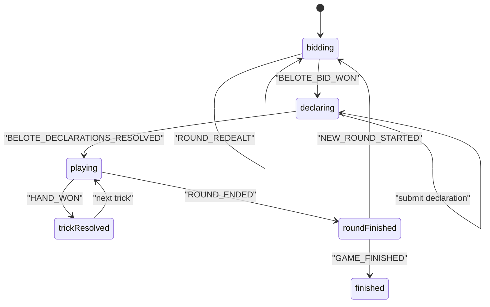

# مستند اجرایی بازی بلوت برای فرانت وب (WS v3) - As-Is + Gap

- نسخه: `1.0`
- تاریخ: `2026-04-12`
- وضعیت: `Ready for Frontend Implementation`
- دامنه: `Belote Gameplay + WS Core (ACK/ERROR/Resync/StateVersion)`

---

## 1) Contract Scope & Source of Truth

این سند با سیاست `As-Is + Gap` نوشته شده است:

- `As-Is`: رفتار runtime فعلی backend مرجع اصلی است.
- `Contract`: قرارداد WS v3 و کاتالوگ payloadها مرجع ثانویه است.
- `GAP`: هر اختلاف بین runtime و contract با شناسه `GAP-###` ثبت می‌شود.

### 1.1 مرجع‌های اصلی کد

1. Backend WS v3 Router:
- `gameBackend/src/main/java/com/gameapp/game/ImprovedWebSocketConfig.java`

2. Backend Belote Runtime:
- `gameBackend/src/main/java/com/gameapp/game/services/BeloteEngineService.java`
- `gameBackend/src/main/java/com/gameapp/game/services/BeloteBotStrategy.java`

3. Backend Broadcast/Envelope/Error:
- `gameBackend/src/main/java/com/gameapp/game/services/WebSocketRoomService.java`
- `gameBackend/src/main/java/com/gameapp/game/services/WsEnvelopeService.java`
- `gameBackend/src/main/java/com/gameapp/game/services/WebSocketMessageHandler.java`
- `gameBackend/src/main/java/com/gameapp/game/constants/WsErrorCodes.java`

4. Frontend Runtime:
- `gameapp/lib/features/game/ui/game_ui/belote_game_ui.dart`
- `gameapp/lib/features/game/data/models/belote_game_state.dart`
- `gameapp/lib/core/websocket/ws_contract_catalog.dart`

5. Contract Docs:
- `docs/WS_V3_PAYLOAD_INVENTORY.md`
- `docs/OPUS_WS_V3_IMPLEMENTATION_GUIDE.md`
- `docs/opus_ws_v3_contract.json`

### 1.2 محدوده خارج از این سند

- social/friends/wallet/history
- legacy `/ws-v2`
- cut-only / no-shuffle tabletop convention

---

## 2) WS Endpoint, Envelope, Connection Rules

## 2.1 Endpoint

- `endpoint`: `/ws-v3`
- `protocolVersion`: `v3`

## 2.2 Envelope Contract

کلاینت باید همه پیام‌ها را به‌صورت envelope تفسیر کند. فیلدهای مهم:

- `type`
- `action`
- `roomId`
- `data`
- `eventId`
- `traceId`
- `serverTime`
- `protocolVersion`
- `stateVersion`
- `clientActionId`

---

## 3) Public Interfaces & Type Contracts (TypeScript)

```ts
export type CardSuit = "hearts" | "spades" | "diamonds" | "clubs";
export type CardRank = "7" | "8" | "9" | "10" | "J" | "Q" | "K" | "A";
export type CardWire = `${CardRank}${"h" | "s" | "d" | "c"}`;

export type BelotePhase =
  | "waitingForPlayers"
  | "bidding"
  | "declaring"
  | "playing"
  | "roundFinished"
  | "finished";

export type BeloteContractType = "SUIT" | "NO_TRUMP" | "ALL_TRUMPS";

export type BeloteAction =
  | "BELOTE_SUBMIT_BID"
  | "BELOTE_PASS_BID"
  | "BELOTE_DOUBLE"
  | "BELOTE_REDUBLE"
  | "BELOTE_SUBMIT_DECLARATION"
  | "BELOTE_PLAY_CARD";

export type BeloteSignalAction =
  | "GAME_STATE_UPDATED"
  | "TURN_TIMER_STARTED"
  | "BELOTE_BID_WON"
  | "BELOTE_BID_DOUBLED"
  | "BELOTE_BID_REDOUBLED"
  | "BELOTE_DECLARATION_SUBMITTED"
  | "BELOTE_DECLARATIONS_RESOLVED"
  | "BELOTE_DECLARED"
  | "HAND_WON"
  | "ROUND_ENDED"
  | "ROUND_REDEALT"
  | "NEW_ROUND_STARTED"
  | "GAME_FINISHED";

export interface BeloteDeclarationOption {
  id: string;
  playerId?: number;
  teamId?: number;
  type: string;
  label: string;
  points: number;
  priority: number;
  suit?: CardSuit;
  highRank?: CardRank;
  cards: CardWire[];
  passed?: boolean;
}

export interface BelotePlayerState {
  playerId: number;
  username: string;
  seatNumber: number;
  teamId: 1 | 2;
  score: number;
  cardCount: number;
  isCurrentTurn?: boolean;
  isDeclarer?: boolean;
  controlMode?: "HUMAN" | "SYSTEM";
  handCards: Array<{ suit: CardSuit; rank: CardRank }>;
}

export interface BeloteUiState {
  gameType: "BELOTE";
  gameId: string;
  gameStateId: number;
  roomId: number;
  phase: BelotePhase;
  currentRound: number;
  currentTurnPlayerId?: number;
  currentBidderId?: number;
  currentDeclarationPlayerId?: number;
  dealerSeat?: number;
  declarerPlayerId?: number;
  declarerTeamId?: 1 | 2;
  highestBidderId?: number;
  contractType?: BeloteContractType;
  contractDisplay?: string;
  trumpSuit?: CardSuit;
  contractMultiplier: 1 | 2 | 4;
  doubledByTeamId?: 1 | 2;
  redoubledByTeamId?: 1 | 2;
  leadSuit?: CardSuit;
  teamAScore: number;
  teamBScore: number;
  teamATrickPoints: number;
  teamBTrickPoints: number;
  teamATricks: number;
  teamBTricks: number;
  teamADeclarationPoints: number;
  teamBDeclarationPoints: number;
  teamABelotePoints: number;
  teamBBelotePoints: number;
  targetScore: 151;
  hangingMatchPoints: number;
  declarationWinnerTeamId: 0 | 1 | 2;
  bidHistory: Array<Record<string, unknown>>;
  declarationChoices: BeloteDeclarationOption[];
  availableDeclarations: BeloteDeclarationOption[];
  playedCards: Array<Record<string, unknown>>;
  playedCardsWithSeats: Array<Record<string, unknown>>;
  playedCardsHistory: Array<Record<string, unknown>>;
  players: BelotePlayerState[];
  pendingSurrender?: Record<string, unknown>;
  surrenderCooldownUntil?: unknown;
  stateVersion: number;
}
```

---

## 4) Belote Action Catalog (Client -> Server)

| اکشن | ورودی اجباری | ورودی اختیاری | ولیدیشن فرانت قبل از ارسال | ACK | سیگنال async مورد انتظار |
|---|---|---|---|---|---|
| `BELOTE_SUBMIT_BID` | `gameStateId`, `contractType` | `trumpSuit` | فاز `bidding`، نوبت بازیکن، bid باید از highest bid فعلی بالاتر باشد | `ACTION_ACK` | `GAME_STATE_UPDATED` و در lock شدن قرارداد `BELOTE_BID_WON` |
| `BELOTE_PASS_BID` | `gameStateId` | - | فاز `bidding` و نوبت بازیکن | `ACTION_ACK` | `GAME_STATE_UPDATED` یا `ROUND_REDEALT` |
| `BELOTE_DOUBLE` | `gameStateId` | - | فقط تیم مقابل declarer و فقط وقتی هنوز double نشده | `ACTION_ACK` | `BELOTE_BID_DOUBLED` + `GAME_STATE_UPDATED` |
| `BELOTE_REDUBLE` | `gameStateId` | - | فقط تیم declarer و فقط بعد از double | `ACTION_ACK` | `BELOTE_BID_REDOUBLED` + `GAME_STATE_UPDATED` |
| `BELOTE_SUBMIT_DECLARATION` | `gameStateId` | `declarationId` | فاز `declaring`، نوبت بازیکن، `declarationId` باید از `availableDeclarations[]` همان بازیکن باشد | `ACTION_ACK` | `BELOTE_DECLARATION_SUBMITTED` و در پایان `BELOTE_DECLARATIONS_RESOLVED` |
| `BELOTE_PLAY_CARD` | `gameStateId`, `card` | - | فاز `playing`، نوبت بازیکن، follow-suit / must-trump / overtrump رعایت شود | `ACTION_ACK` | `GAME_STATE_UPDATED`، `HAND_WON`، `ROUND_ENDED` |

---

## 5) Belote Signal Catalog (Server -> Client)

| `action` | فیلدهای کلیدی data | معنای عملیاتی |
|---|---|---|
| `GAME_STATE_UPDATED` | کل payload نرمال‌شده‌ی `BeloteUiState` | منبع authoritative اصلی state |
| `TURN_TIMER_STARTED` | `timeoutSeconds` | تایمر bidding/declaration/play |
| `BELOTE_BID_WON` | `playerId`, `teamId`, `contractType`, `trumpSuit`, `contractDisplay`, `contractMultiplier` | قرارداد قفل شد |
| `BELOTE_BID_DOUBLED` | `playerId`, `teamId`, `contractMultiplier=2` | اعلام double |
| `BELOTE_BID_REDOUBLED` | `playerId`, `teamId`, `contractMultiplier=4` | اعلام redouble |
| `BELOTE_DECLARATION_SUBMITTED` | `playerId`, `passed`, `declaration?` | ثبت declaration/pass |
| `BELOTE_DECLARATIONS_RESOLVED` | `declarationWinnerTeamId`, `teamADeclarationPoints`, `teamBDeclarationPoints`, `declarationChoices[]` | جمع‌بندی declarations |
| `BELOTE_DECLARED` | `playerId`, `teamId`, `suit`, `points=20` | award شدن belote/rebelote در play |
| `HAND_WON` | `winnerId`, `teamId`, `winningCard`, `trickPoints` و totals | پایان trick |
| `ROUND_ENDED` | قرارداد، trick/declaration/belote/raw/match points، score نهایی | پایان راند |
| `ROUND_REDEALT` | `reason=ALL_PASSED`, `nextDealerSeat` | `4` opening pass و redeal بدون score |
| `NEW_ROUND_STARTED` | state راند جدید | شروع راند بعد |
| `GAME_FINISHED` | `players`, `winnerTeamId`, `participantResults`, `coinRewards`, `xpRewards` | پایان match در `151` |

### 5.1 قاعده State Authority

1. `GAME_STATE_UPDATED` و `NEW_ROUND_STARTED` مرجع اصلی state هستند.
2. `STATE_SNAPSHOT` برای Belote باید هم‌شکل payload gameplay باشد.
3. eventهای result مثل `BELOTE_BID_WON`, `HAND_WON`, `ROUND_ENDED` جایگزین state کامل نیستند.

---

## 6) Frontend Behavior Matrix

| Trigger | کار روی State | کار UI/UX | Side Effect |
|---|---|---|---|
| ارسال `BELOTE_SUBMIT_BID` | pendingAction اضافه شود | bid controls lock شوند | منتظر `ACTION_ACK` |
| دریافت `BELOTE_BID_WON` | state بعدی apply شود | contract banner/snackbar | declaration timer آماده شود |
| دریافت `GAME_STATE_UPDATED` با `phase=declaring` | replace کامل state | declaration picker نمایش داده شود | timer reset |
| ارسال `BELOTE_SUBMIT_DECLARATION` | pendingAction اضافه شود | declaration submit disable شود | منتظر state بعدی |
| دریافت `BELOTE_DECLARATIONS_RESOLVED` | declaration result patch شود | اعلان تیم برنده declarations | transition به play |
| ارسال `BELOTE_PLAY_CARD` | pendingAction اضافه شود | کارت انتخابی lock شود | optimistic removal انجام نشود |
| دریافت `HAND_WON` | played cards reset شوند | انیمیشن برنده trick | منتظر update بعدی |
| دریافت `ROUND_REDEALT` | انتخاب‌های pending پاک شوند | پیام redeal | state جدید apply شود |
| دریافت `ROUND_ENDED` | summary patch شود | dialog پایان راند | اگر بازی تمام نشده منتظر `NEW_ROUND_STARTED` |
| دریافت `STATE_SNAPSHOT` | replace کامل state | خروج از loading | pending نامعتبر پاک شود |

---

## 7) State Machine



---

## 8) Error & Resync Policy

| `errorCode` | Trigger رایج | اقدام قطعی فرانت |
|---|---|---|
| `ACTION_REJECTED` | move غیرمجاز، payload غلط، state conflict | pending را پاک کن، خطا نشان بده، optimistic patch نزن |
| `STATE_RESYNC_REQUIRED` | `stateVersion` قدیمی یا out-of-order | فوری `GET_GAME_STATE_BY_ROOM` |
| `RATE_LIMITED` | throttling | backoff |
| `AUTH_EXPIRED` | session منقضی | logout flow |

---

## 9) GAP Register

| GAP ID | عنوان | Severity | As-Is | Workaround فرانت | وضعیت |
|---|---|---|---|---|---|
| `GAP-001` | `ROUND_REDEALT` قبلاً در catalog عمومی ثبت نشده بود | Medium | runtime emit می‌شد | reducer آن را informational بگیرد و بعد state update را apply کند | برطرف شد |
| `GAP-002` | eventهای informational Belote در بعضی UIها feedback نداشتند | Low | sync می‌رسید ولی UX ساکت بود | snackbar/banner سبک | برطرف شد |

---

## 10) Payload Examples

## 10.1 `BELOTE_SUBMIT_BID`

```json
{
  "type": "GAME_ACTION",
  "action": "BELOTE_SUBMIT_BID",
  "roomId": 1452,
  "clientActionId": "ca_1744431000000_1",
  "protocolVersion": "v3",
  "data": {
    "gameStateId": 9088,
    "contractType": "SUIT",
    "trumpSuit": "hearts",
    "stateVersion": 41
  }
}
```

## 10.2 `ROUND_ENDED`

```json
{
  "type": "GAME_ACTION",
  "action": "ROUND_ENDED",
  "roomId": 1452,
  "stateVersion": 66,
  "data": {
    "roundNumber": 3,
    "contractType": "SUIT",
    "trumpSuit": "hearts",
    "contractDisplay": "دل",
    "contractMultiplier": 2,
    "declarerTeamId": 1,
    "declarerMadeContract": true,
    "teamATricks": 5,
    "teamBTricks": 3,
    "teamATrickPoints": 98,
    "teamBTrickPoints": 64,
    "teamADeclarationPoints": 50,
    "teamBDeclarationPoints": 0,
    "teamABelotePoints": 20,
    "teamBBelotePoints": 0,
    "awardedRawA": 168,
    "awardedRawB": 0,
    "roundMatchPointsA": 17,
    "roundMatchPointsB": 0,
    "teamAScore": 102,
    "teamBScore": 81,
    "winnerTeamId": 1
  }
}
```

## 10.3 `STATE_SNAPSHOT`

```json
{
  "type": "STATE_SNAPSHOT",
  "success": true,
  "roomId": 1452,
  "stateVersion": 66,
  "data": {
    "gameType": "BELOTE",
    "gameId": "9088",
    "gameStateId": 9088,
    "roomId": 1452,
    "phase": "playing",
    "currentRound": 3,
    "currentTurnPlayerId": 34,
    "contractType": "SUIT",
    "contractDisplay": "دل",
    "trumpSuit": "hearts",
    "players": [],
    "playedCards": [],
    "playedCardsWithSeats": [],
    "availableDeclarations": [],
    "stateVersion": 66
  }
}
```

---

## 11) QA Checklist

- [ ] bid order: `clubs < diamonds < hearts < spades < noTrump < allTrump`
- [ ] `4` opening pass => `ROUND_REDEALT` و dealer rotation
- [ ] double / redouble flow با turn ownership درست
- [ ] declaration submit/pass برای هر چهار بازیکن
- [ ] `BELOTE_DECLARATIONS_RESOLVED` سپس `phase=playing`
- [ ] belote/rebelote فقط بعد از بازی شدن هر دو `K/Q`
- [ ] follow-suit / must-trump / overtrump
- [ ] round scoring با fail / hang / valat / double / redouble
- [ ] finish match در `151`
- [ ] `STATE_SNAPSHOT` هم‌شکل payload gameplay باقی بماند
