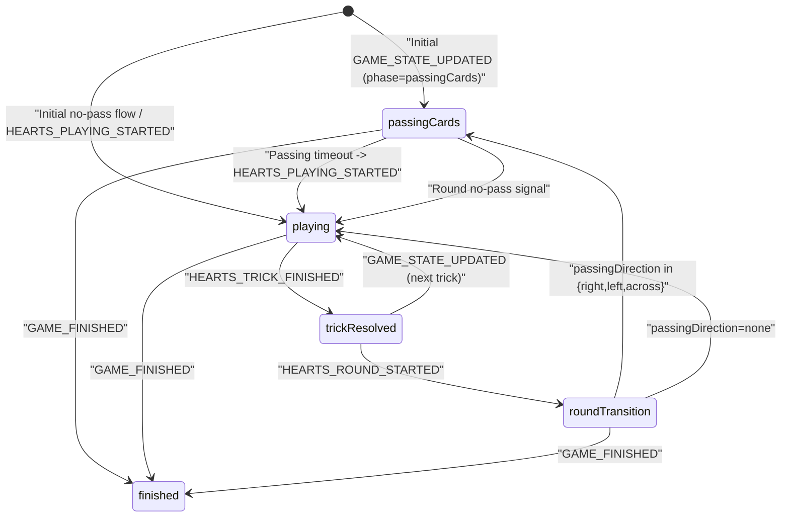

# مستند اجرایی بازی بی‌دل (Hearts) برای فرانت وب (WS v3) - As-Is + Gap

- نسخه: `1.0`
- تاریخ: `2026-03-03`
- وضعیت: `Ready for Frontend Implementation`
- دامنه: `Hearts Gameplay + WS Core (ACK/ERROR/Resync/StateVersion)`

---

## 1) Contract Scope & Source of Truth

این سند با سیاست `As-Is + Gap` نوشته شده است:

- `As-Is`: رفتار runtime فعلی backend مرجع اصلی است.
- `Contract`: قرارداد WS v3 و کاتالوگ payloadها مرجع ثانویه است.
- `GAP`: هر اختلاف بین runtime و contract با شناسه `GAP-###` ثبت می‌شود.

### 1.1 مرجع‌های اصلی کد

1. Backend WS v3 Router:
- `gameBackend/src/main/java/com/gameapp/game/ImprovedWebSocketConfig.java`

2. Backend Hearts Runtime:
- `gameBackend/src/main/java/com/gameapp/game/services/HeartsEngineService.java`

3. Backend Broadcast/Envelope/Error:
- `gameBackend/src/main/java/com/gameapp/game/services/WebSocketRoomService.java`
- `gameBackend/src/main/java/com/gameapp/game/services/WsEnvelopeService.java`
- `gameBackend/src/main/java/com/gameapp/game/services/WebSocketMessageHandler.java`
- `gameBackend/src/main/java/com/gameapp/game/constants/WsErrorCodes.java`

4. Frontend WS Runtime:
- `gameapp/lib/core/services/websocket_manager.dart`
- `gameapp/lib/core/websocket/ws_contract_catalog.dart`
- `gameapp/lib/core/websocket/ws_error_policy.dart`

5. Frontend Hearts UI Reference:
- `gameapp/lib/features/game/ui/game_ui/hearts_game_ui.dart`
- `gameapp/lib/features/game/data/models/hearts_game_state.dart`
- `gameapp/lib/features/game/data/models/card.dart`

6. Contract Docs:
- `docs/WS_V3_PAYLOAD_INVENTORY.md`
- `docs/OPUS_WS_V3_IMPLEMENTATION_GUIDE.md`
- `docs/opus_ws_v3_contract.json`

### 1.2 محدوده خارج از این سند

- قابلیت‌های social/friends/wallet/history
- بازی‌های غیر از Hearts
- مسیر legacy `/ws-v2` و `WebSocketController` قدیمی

---

## 2) WS Endpoint, Envelope, Connection Rules

## 2.1 Endpoint

- `endpoint`: `/ws-v3`
- `protocolVersion`: `v3`

## 2.2 Envelope Contract

کلاینت باید همه پیام‌ها را به‌صورت envelope تفسیر کند. فیلدهای مهم:

- `type`
- `action` (برای `GAME_ACTION`)
- `roomId`
- `data`
- `eventId`
- `traceId`
- `serverTime`
- `protocolVersion`
- `stateVersion`
- `clientActionId` (برای همبستگی اکشن‌ها)

## 2.3 AUTH الزامات

درخواست `AUTH` باید شامل این فیلدها باشد:

- `token`
- `protocolVersion`
- `appVersion`
- `capabilities`
- `deviceId` (در حالت enforce)

### نمونه AUTH

```json
{
  "type": "AUTH",
  "token": "<jwt>",
  "protocolVersion": "v3",
  "appVersion": "3.0.0",
  "capabilities": [
    "CLIENT_ACTION_ID",
    "EVENT_DEDUP",
    "ACTION_ACK",
    "ACTION_REJECTED",
    "RESYNC_HANDLER",
    "STATE_VERSION",
    "MATCH_ID",
    "CLIENT_TELEMETRY"
  ],
  "deviceId": "web-device-001"
}
```

## 2.4 رفتار اجباری session/auth error

| `errorCode` | رفتار اجباری فرانت |
|---|---|
| `AUTH_EXPIRED` | پاک‌سازی auth، قطع WS، هدایت به login |
| `TOKEN_REVOKED` | پاک‌سازی auth، قطع WS، هدایت به login |
| `INVALID_TOKEN` | پاک‌سازی auth، قطع WS، هدایت به login |

---

## 3) Public Interfaces & Type Contracts (TypeScript)

این تایپ‌ها قرارداد مرجع فرانت وب هستند.

```ts
export type WsMessageType =
  | "AUTH"
  | "GAME_ACTION"
  | "GET_GAME_STATE_BY_ROOM"
  | "ACTION_ACK"
  | "STATE_SNAPSHOT"
  | "ERROR"
  | "GAME_STARTED";

export type CardSuit = "hearts" | "spades" | "diamonds" | "clubs";
export type HeartsRankWord =
  | "ace" | "king" | "queen" | "jack"
  | "ten" | "nine" | "eight" | "seven" | "six" | "five" | "four" | "three" | "two";
export type HeartsRankSymbol = "A" | "K" | "Q" | "J" | "10" | "9" | "8" | "7" | "6" | "5" | "4" | "3" | "2";
export type HeartsCardCompact = `${HeartsRankSymbol}${"♠" | "♥" | "♦" | "♣"}`;

export type HeartsAction =
  | "PASS_CARDS_SELECTION"
  | "HEARTS_PLAY_CARD"
  | "START_HEARTS_GAME"
  | "HEARTS_PASSING_TIMER_ENDED";

export type HeartsSignalAction =
  | "GAME_STATE_UPDATED"
  | "HEARTS_ROUND_STARTED"
  | "HEARTS_PLAYING_STARTED"
  | "CARD_PLAYED"
  | "HEARTS_TRICK_FINISHED"
  | "GAME_FINISHED";

export interface WsEnvelope<TData = unknown> {
  type: string;
  action?: string;
  roomId?: number;
  success?: boolean;
  data?: TData;
  errorCode?: string;
  error?: string;
  eventId?: string;
  traceId?: string;
  serverTime?: string;
  protocolVersion?: string;
  stateVersion?: number;
  clientActionId?: string;
}

export interface HeartsCard {
  suit: CardSuit;
  rank: HeartsRankWord | HeartsRankSymbol;
  isVisible?: boolean;
}

export interface HeartsPlayerState {
  playerId: number;
  username: string;
  isCurrentTurn?: boolean;
  negativeScore?: number; // امتیاز راند جاری
  seatNumber?: number;
  hasPassedCards?: boolean;
  handCards?: HeartsCard[];
}

export interface HeartsUiState {
  gameStateId: number;
  roomId: number;
  gameId?: string;
  phase: "passingCards" | "playing" | "gameFinished";
  currentRound: number;
  currentTrick: number;
  currentTurnPlayerId?: number;
  passingDirection?: "right" | "left" | "across" | "none";
  heartsBroken: boolean;
  leadSuit?: CardSuit | null;
  scores: Record<number, number>; // cumulative score
  players: HeartsPlayerState[];
  playedCards: HeartsCard[];
  playedCardsWithSeats: Array<Record<string, unknown>>;
  stateVersion: number;
}

export interface HeartsActionPayloadMap {
  PASS_CARDS_SELECTION: {
    playerId: number;
    cards: Array<{ suit: CardSuit; rank: HeartsRankWord | HeartsRankSymbol }>;
    stateVersion: number;
  };
  HEARTS_PLAY_CARD: {
    playerId: number;
    card: { suit: CardSuit; rank: HeartsRankWord | HeartsRankSymbol };
    stateVersion: number;
  };
  START_HEARTS_GAME: {
    stateVersion: number;
  };
  HEARTS_PASSING_TIMER_ENDED: {
    stateVersion: number;
  };
}

export interface HeartsSignalPayloadMap {
  GAME_STATE_UPDATED: Partial<HeartsUiState> & { gameStateId?: number; roomId?: number };
  HEARTS_ROUND_STARTED: {
    gameStateId: number;
    roomId: number;
    phase: "passingCards" | "playing";
    currentRound: number;
    passingDirection: "right" | "left" | "across" | "none";
    scores?: Record<string, number>;
  };
  HEARTS_PLAYING_STARTED: {
    gameStateId: number;
    roomId: number;
    phase: "playing";
    currentRound: number;
    currentTrick: number;
    currentTurnPlayerId: number;
    heartsBroken: boolean;
    scores?: Record<string, number>;
    players?: HeartsPlayerState[];
    playedCards?: HeartsCard[];
    playedCardsWithSeats?: Array<Record<string, unknown>>;
  };
  CARD_PLAYED: {
    gameStateId: number;
    roomId: number;
    playerId: number;
    playedCard: HeartsCard;
    currentTurnPlayerId: number;
    heartsBroken: boolean;
  };
  HEARTS_TRICK_FINISHED: {
    gameStateId: number;
    roomId: number;
    winnerPlayerId: number;
    trickScore: number;
    currentTrick: number;
    roundScores?: Record<string, number>;
    totalScores?: Record<string, number>;
  };
  GAME_FINISHED: {
    gameStateId: number;
    roomId: number;
    phase: "gameFinished";
    winnerId: number;
    finalScores: Record<string, number>;
    players: Array<{
      id?: number;
      username?: string;
      score?: number;
      coins?: number;
      xp?: number;
      isWinner?: boolean;
    }>;
    coinRewards?: { totalPot?: number; platformFee?: number; winnerReward?: number; rewardPerWinner?: number };
    xpRewards?: { winner?: number; loser?: number };
  };
}

export interface PendingActionState {
  clientActionId: string;
  action: HeartsAction;
  roomId: number;
  sentAtMs: number;
  retryCount: number;
  maxRetries: number;
  ackTimeoutMs: number;
}
```

---

## 4) Hearts Action Catalog (Client -> Server)

## 4.1 قواعد عمومی `GAME_ACTION`

- `type` باید `GAME_ACTION` باشد.
- `action` اجباری است.
- `roomId` اجباری است.
- `clientActionId` اجباری است.
- `data.stateVersion` اجباری است.
- اگر `playerId` در payload ارسال شود، باید با session user یکسان باشد؛ مرجع نهایی بازیکن، session است.
- `ACTION_ACK` به معنی پذیرش در صف پردازش است، نه نتیجه نهایی state.

## 4.2 جدول اکشن‌ها

| اکشن | Envelope | ورودی اجباری | ورودی اختیاری | ولیدیشن فرانت قبل از ارسال | ACK مورد انتظار | سیگنال async مورد انتظار | خطاهای محتمل |
|---|---|---|---|---|---|---|---|
| `PASS_CARDS_SELECTION` | `type=GAME_ACTION`, `action=PASS_CARDS_SELECTION` | `playerId`, `cards[]`, `stateVersion` | - | فاز باید `passingCards` باشد، `passingDirection != none`، تعداد کارت `<=3`، کارت تکراری نباشد، `2♣` انتخاب نشود | `ACTION_ACK` | معمولاً immediate event ندارد؛ بعد از timeout پاس: `HEARTS_PLAYING_STARTED` | `ACTION_REJECTED`, `STATE_RESYNC_REQUIRED`, `RATE_LIMITED` |
| `HEARTS_PLAY_CARD` | `type=GAME_ACTION`, `action=HEARTS_PLAY_CARD` | `playerId`, `card`, `stateVersion` | - | نوبت کاربر باشد، کارت در دست باشد، follow-suit رعایت شود، trick اول هر راند با `2♣` شروع شود، قبل از break شدن دل محدودیت hearts/Q♠ رعایت شود | `ACTION_ACK` | `CARD_PLAYED`؛ سپس `GAME_STATE_UPDATED` یا در کارت چهارم `HEARTS_TRICK_FINISHED` و بعد state/round/game events | `ACTION_REJECTED`, `STATE_RESYNC_REQUIRED`, `RATE_LIMITED` |
| `START_HEARTS_GAME` | `type=GAME_ACTION`, `action=START_HEARTS_GAME` | `stateVersion` | - | در وب ارسال نشود (compat only) | `ACTION_ACK` | As-Is: no-op | `ACTION_REJECTED` |
| `HEARTS_PASSING_TIMER_ENDED` | `type=GAME_ACTION`, `action=HEARTS_PASSING_TIMER_ENDED` | `stateVersion` | - | در وب ارسال نشود (timer سمت سرور authoritative است) | `ACTION_ACK` | As-Is: ignored/no-op | `ACTION_REJECTED` |
| `GET_GAME_STATE_BY_ROOM` | `type=GET_GAME_STATE_BY_ROOM` | `roomId` | - | در resync/timeout watchdog یا ورود دیرهنگام استفاده شود | Success envelope | `STATE_SNAPSHOT` | `ACTION_REJECTED` |

## 4.3 Card Encoding (As-Is)

### outgoing (`HEARTS_PLAY_CARD`, `PASS_CARDS_SELECTION`)

- فرمت canonical فرانت: آبجکت کارت `{ suit, rank }`
- `suit ∈ {hearts, spades, diamonds, clubs}`
- `rank` ترجیحاً enum word (مثل `queen`, `ten`, `two`)

### internal runtime

- backend کارت را به compact format تبدیل می‌کند: `rankSymbol + suitSymbol`
- مثال: `2♣`, `Q♠`, `10♥`

نکته: payloadهای ورودی/خروجی ممکن است rank را به‌صورت word یا symbol بدهند؛ parser فرانت باید هر دو را قبول کند.

---

## 5) Hearts Signal Catalog (Server -> Client)

## 5.1 سیگنال‌های هسته

| سیگنال | شکل envelope | فیلدهای مهم payload | معنای عملیاتی |
|---|---|---|---|
| `GAME_STARTED` | `type=GAME_STARTED` | `roomId`, `gameType` | شروع رسمی بازی در روم (در Hearts ws-v3 تضمین قطعی ندارد؛ GAP-006) |
| `ACTION_ACK` | `type=ACTION_ACK` | `data.action`, `data.roomId`, `data.clientActionId`, `data.accepted`, `data.stateVersion?`, `data.duplicate?` | پذیرش اکشن در صف؛ نه نتیجه نهایی |
| `ERROR` | `type=ERROR` | `action`, `errorCode`, `error`, `roomId?`, `clientActionId?`, `stateVersion?` | خطای پروتکل/اکشن |
| `STATE_SNAPSHOT` | `type=STATE_SNAPSHOT` | `roomId`, `data` | snapshot authoritative برای resync |

## 5.2 سیگنال‌های gameplay بی‌دل (`type=GAME_ACTION`)

| `action` | فیلدهای کلیدی data (As-Is runtime) | اثر روی state |
|---|---|---|
| `GAME_STATE_UPDATED` | دو shape دارد: 1) full: `gameId`, `phase`, `currentTurnPlayerId`, `currentRound`, `currentTrick`, `passingDirection`, `scores`, `heartsBroken`, `players[]`, `playedCards[]`, `playedCardsWithSeats[]`; 2) minimal: `phase`, `currentTurnPlayerId`, `currentRound`, `currentTrick`, `heartsBroken` | سیگنال state-authoritative اما payload ناهمگن است؛ merge-safe لازم است |
| `HEARTS_ROUND_STARTED` | `gameStateId`, `roomId`, `phase`, `currentRound`, `passingDirection`, `scores` | اعلام شروع راند جدید و تعیین مسیر `passing`/`no passing` |
| `HEARTS_PLAYING_STARTED` | `gameStateId`, `roomId`, `phase=playing`, `currentRound`, `currentTrick`, `currentTurnPlayerId`, `heartsBroken`, `scores`, `players[]`, `playedCards[]`, `playedCardsWithSeats[]` | شروع فاز بازی بعد از پاس یا راند no-pass |
| `CARD_PLAYED` | `gameStateId`, `roomId`, `playedCard`, `playerId`, `currentTurnPlayerId`, `heartsBroken` | نتیجه play یک کارت؛ برای update سریع میز |
| `HEARTS_TRICK_FINISHED` | `roomId`, `gameStateId`, `winnerPlayerId`, `trickScore`, `currentTrick`, `roundScores`, `totalScores` | پایان trick و اعلام برنده/امتیاز |
| `GAME_FINISHED` | `gameStateId`, `roomId`, `phase=gameFinished`, `winnerId`, `finalScores`, `players[]`, `coinRewards`, `xpRewards` | پایان بازی و نمایش نتیجه نهایی |

## 5.3 قاعده State Authority

1. `GAME_STATE_UPDATED` مرجع اصلی state است اما باید به‌صورت patch-safe اعمال شود (shape ناهمگن).
2. `HEARTS_ROUND_STARTED` و `HEARTS_PLAYING_STARTED` سیگنال transition هستند و باید phase/timer/round را تعیین کنند.
3. `CARD_PLAYED` و `HEARTS_TRICK_FINISHED` result-event هستند؛ به‌تنهایی state کامل نیستند.
4. در `STATE_SNAPSHOT` باید replace کامل state انجام شود، نه merge جزئی.

---

## 6) Frontend Behavior Matrix (اکشن/سیگنال -> کار فرانت)

| Trigger | کار روی Store/State | کار UI/UX | Side Effects |
|---|---|---|---|
| ارسال `PASS_CARDS_SELECTION` | pendingAction اضافه شود، فقط selection محلی نگه داشته شود | اسلات انتخاب 0..3 آپدیت شود | انتظار ACK؛ بدون optimistic mutation روی hand اصلی |
| دریافت `ACTION_ACK` برای `PASS_CARDS_SELECTION` | pendingAction حذف شود | پیام transient اختیاری | تا پایان تایمر، همچنان در passing بماند |
| ارسال `HEARTS_PLAY_CARD` | pendingAction اضافه شود | کارت select-lock و دکمه submit غیرفعال | optimistic حذف کارت انجام نشود |
| دریافت `ACTION_ACK` برای `HEARTS_PLAY_CARD` | pendingAction حذف شود | پیام transient اختیاری | منتظر `CARD_PLAYED`/`GAME_STATE_UPDATED` بماند |
| دریافت `CARD_PLAYED` | patch روی `playedCards`/`leadSuit`/`currentTurnPlayerId` | انیمیشن پرتاب کارت | تایمر turn ری‌استارت شود |
| دریافت `GAME_STATE_UPDATED` full | merge/reconcile کامل فیلدهای موجود | sync کامل UI با سرور | reset timerها بر اساس فاز جدید |
| دریافت `GAME_STATE_UPDATED` minimal | فقط کلیدهای موجود patch شود | بدون overwrite لیست players/hand اگر در payload نیست | اگر parser ambiguous شد snapshot pull |
| دریافت `HEARTS_ROUND_STARTED` | `currentRound`, `passingDirection`, `phase` آپدیت | اگر `passingDirection=none` پیام «بدون انتقال» | reset `selectedCardsToPass` |
| دریافت `HEARTS_PLAYING_STARTED` | phase=`playing`, trick/turn/scores آپدیت | بستن UI passing و شروع UI بازی | در صورت نیاز `GET_GAME_STATE_BY_ROOM` برای تکمیل |
| دریافت `HEARTS_TRICK_FINISHED` | `playedCards=[]`, `leadSuit=null`, scores/negativeScore patch | انیمیشن برد دست و امتیاز | آماده trick بعدی یا round transition |
| دریافت `GAME_FINISHED` | state قفل نهایی | modal نتیجه + coin/xp + leaderboard | navigation به home/lobby |
| دریافت `ERROR/ACTION_REJECTED` | pendingAction مرتبط حذف شود | پیام خطا به کاربر | اکشن retry اختیاری |
| دریافت `ERROR/STATE_RESYNC_REQUIRED` | state موقتاً freeze | loading کوتاه | فوری `GET_GAME_STATE_BY_ROOM` |
| دریافت `STATE_SNAPSHOT` | replace کامل state | خروج از loading | reset pending غیرمرتبط |

### 6.1 Rule: Non-Optimistic Gameplay

- `HEARTS_PLAY_CARD` باید non-optimistic باشد.
- `PASS_CARDS_SELECTION` فقط selection local UI را تغییر دهد؛ state بازی را تغییر ندهد.
- state پایدار فقط با سیگنال authoritative (`GAME_STATE_UPDATED` یا `STATE_SNAPSHOT`) تثبیت شود.

### 6.2 Timer Rules

- Passing timer در UI فقط نمایش/UX است؛ timeout اصلی سمت سرور است.
- Turn timer در runtime Hearts server-authoritative نیست (GAP-005)؛ فرانت باید watchdog/resync داشته باشد.

---

## 7) Hearts State Machine



## 7.1 قوانین نوبت و move validation

- فقط بازیکنی که `currentTurnPlayerId == myUserId` دارد می‌تواند `HEARTS_PLAY_CARD` بزند.
- اگر `leadSuit` در دست بازیکن وجود دارد، باید همان خال بازی شود.
- trick اول هر راند باید با `2♣` شروع شود.
- قبل از `heartsBroken=true`، شروع trick با دل یا `Q♠` مجاز نیست (طبق constraints فعلی runtime).

---

## 8) Error & Resync Policy

| `errorCode` | Trigger رایج | اقدام قطعی فرانت |
|---|---|---|
| `ACTION_REJECTED` | payload غلط، move غیرمجاز، mismatch playerId/session | نمایش خطا، پاک‌کردن pending مرتبط |
| `STATE_RESYNC_REQUIRED` | `stateVersion` قدیمی یا conflict | فوری `GET_GAME_STATE_BY_ROOM` و replace کامل state |
| `RATE_LIMITED` | throttling سرور | backoff و retry بعدی |
| `AUTH_EXPIRED` | session/token منقضی | logout flow اجباری |
| `TOKEN_REVOKED` | revoke سمت سرور | logout flow اجباری |
| `INVALID_TOKEN` | JWT نامعتبر | logout flow اجباری |

## 8.1 Ordering & Dedup

- بر اساس `eventId`: پیام تکراری drop شود.
- بر اساس `stateVersion`: پیام out-of-order drop شود.
- streamهای ordered برای state: `GAME_ACTION`, `STATE_SNAPSHOT`, `GAME_STATE`.

---

## 9) GAP Register (As-Is vs Contract)

| GAP ID | عنوان | Severity | واقعیت As-Is | اثر روی UX | Workaround فرانت | Backend Fix پیشنهادی |
|---|---|---|---|---|---|---|
| `GAP-001` | `START_HEARTS_GAME` و `HEARTS_PASSING_TIMER_ENDED` no-op هستند | Medium | هر دو اکشن در router وجود دارند اما عملاً کاری نمی‌کنند | اگر فرانت روی این اکشن‌ها flow بسازد، بازی جلو نمی‌رود | این دو اکشن را `reserved/not for web` در نظر بگیرید | از contract اکتیو Hearts حذف یا deprecated شوند |
| `GAP-002` | ترتیب سیگنال در راندهای `passingDirection=none` ناپایدار است | High | در `startHeartsRound` ابتدا `dealHeartsCards` اجرا می‌شود و ممکن است `HEARTS_PLAYING_STARTED` قبل از `HEARTS_ROUND_STARTED` برسد | flicker/phase-jump در UI | reducer باید order-independent باشد؛ هر دو event idempotent apply شوند | ترتیب emission برای no-pass استاندارد شود (`HEARTS_ROUND_STARTED` سپس `HEARTS_PLAYING_STARTED`) |
| `GAP-003` | shape ناهمگن `GAME_STATE_UPDATED` | High | گاهی full payload (players/cards) و گاهی minimal payload (turn/trick/phase) می‌آید | overwrite اشتباه store و حذف ناخواسته hand/players | patch-safe merge + fallback snapshot روی ambiguity | payload shape یکسان (full یا typed delta) استاندارد شود |
| `GAP-004` | انتخاب کارت پاس زودتر از timeout بازی را شروع نمی‌کند | Medium | مسیر ws-v3 در `PASS_CARDS_SELECTION` فقط `storeCardSelection` می‌زند؛ trigger all-ready فوری ندارد | UX کندتر؛ بازیکنان باید منتظر timeout بمانند | UX پیام «منتظر تایمر/سرور» + عدم انتظار برای early start | اگر همه بازیکنان 3 کارت انتخاب کردند، بلافاصله `processHeartsCardPassing` اجرا شود |
| `GAP-005` | turn timeout در Hearts server-authoritative نیست | High | اکشن timeout مخصوص turn برای Hearts وجود ندارد و auto-play/auto-timeout سرور دیده نمی‌شود | احتمال stall اگر بازیکن inactive باشد | watchdog فرانت: بعد از dead-time snapshot pull و UX recovery | تایمر نوبت server-side + event مثل `TURN_TIMER_STARTED`/auto-timeout اضافه شود |
| `GAP-006` | `GAME_STARTED` در flow ws-v3 Hearts قابل اتکای قطعی نیست | Medium | در مسیر runtime فعلی Hearts start به‌صورت مستقیم از engine می‌آید و اتکا به `GAME_STARTED` تضمین نشده | اگر فرانت start را فقط با `GAME_STARTED` ببیند، ممکن است render دیر/ناقص شود | شروع بازی را بر اساس اولین `GAME_STATE_UPDATED` یا `HEARTS_PLAYING_STARTED` انجام دهید | در start engine برای ws-v3 `GAME_STARTED` استاندارد و deterministic broadcast شود |
| `GAP-007` | Shape `STATE_SNAPSHOT` با gameplay payload هم‌شکل نیست | Medium | snapshot از entity `GameState` برمی‌گردد، نه DTO هم‌شکل `GAME_STATE_UPDATED` | parser پیچیده و خطاپذیر | adapter اختصاصی `snapshot -> HeartsUiState` با replace کامل | endpoint snapshot normalized مخصوص gameplay |

---

## 10) Payload Examples (JSON)

## 10.1 `PASS_CARDS_SELECTION` request

```json
{
  "type": "GAME_ACTION",
  "action": "PASS_CARDS_SELECTION",
  "roomId": 2501,
  "clientActionId": "ca_1761981000000_1",
  "protocolVersion": "v3",
  "traceId": "web-hearts-001",
  "data": {
    "playerId": 21,
    "cards": [
      { "suit": "hearts", "rank": "ace" },
      { "suit": "spades", "rank": "queen" },
      { "suit": "diamonds", "rank": "ten" }
    ],
    "stateVersion": 44
  }
}
```

## 10.2 `HEARTS_PLAY_CARD` request

```json
{
  "type": "GAME_ACTION",
  "action": "HEARTS_PLAY_CARD",
  "roomId": 2501,
  "clientActionId": "ca_1761981001200_2",
  "protocolVersion": "v3",
  "traceId": "web-hearts-002",
  "data": {
    "playerId": 21,
    "card": { "suit": "clubs", "rank": "two" },
    "stateVersion": 45
  }
}
```

## 10.3 `ACTION_ACK` response

```json
{
  "type": "ACTION_ACK",
  "success": true,
  "eventId": "97ed6f7c-49df-4d08-9eea-3e53ce7e6b57",
  "traceId": "srv-hearts-1001",
  "serverTime": "2026-03-03T10:45:31.100Z",
  "protocolVersion": "v3",
  "stateVersion": 45,
  "data": {
    "action": "HEARTS_PLAY_CARD",
    "roomId": 2501,
    "clientActionId": "ca_1761981001200_2",
    "accepted": true,
    "stateVersion": 45
  }
}
```

## 10.4 `GAME_STATE_UPDATED` (full) event

```json
{
  "type": "GAME_ACTION",
  "action": "GAME_STATE_UPDATED",
  "roomId": 2501,
  "eventId": "d7a01a95-c5ef-4f5a-ae2a-74056ef22a53",
  "traceId": "srv-hearts-1002",
  "serverTime": "2026-03-03T10:45:31.550Z",
  "protocolVersion": "v3",
  "stateVersion": 46,
  "data": {
    "gameId": "9912",
    "phase": "passingCards",
    "currentTurnPlayerId": 21,
    "currentRound": 1,
    "currentTrick": 1,
    "passingDirection": "right",
    "heartsBroken": false,
    "scores": { "21": 0, "34": 0, "55": 0, "89": 0 },
    "players": [],
    "playedCards": [],
    "playedCardsWithSeats": [],
    "stateVersion": 46
  }
}
```

## 10.5 `CARD_PLAYED` event

```json
{
  "type": "GAME_ACTION",
  "action": "CARD_PLAYED",
  "roomId": 2501,
  "eventId": "040cd63f-173e-4eb0-951b-7aa6b3df47ab",
  "traceId": "srv-hearts-1003",
  "serverTime": "2026-03-03T10:46:11.240Z",
  "protocolVersion": "v3",
  "stateVersion": 47,
  "data": {
    "gameStateId": 9912,
    "roomId": 2501,
    "playerId": 21,
    "playedCard": { "suit": "clubs", "rank": "2", "isVisible": false },
    "currentTurnPlayerId": 34,
    "heartsBroken": false,
    "stateVersion": 47
  }
}
```

## 10.6 `HEARTS_TRICK_FINISHED` event

```json
{
  "type": "GAME_ACTION",
  "action": "HEARTS_TRICK_FINISHED",
  "roomId": 2501,
  "eventId": "4fefe8d3-a91e-4865-ae9e-f9f54683f55f",
  "traceId": "srv-hearts-1004",
  "serverTime": "2026-03-03T10:47:40.901Z",
  "protocolVersion": "v3",
  "stateVersion": 52,
  "data": {
    "roomId": 2501,
    "gameStateId": 9912,
    "winnerPlayerId": 34,
    "trickScore": 2,
    "currentTrick": 5,
    "roundScores": { "21": 0, "34": 2, "55": 0, "89": 0 },
    "totalScores": { "21": 7, "34": 12, "55": 19, "89": 5 },
    "stateVersion": 52
  }
}
```

## 10.7 `GAME_FINISHED` event

```json
{
  "type": "GAME_ACTION",
  "action": "GAME_FINISHED",
  "roomId": 2501,
  "eventId": "e341b85b-59f2-4bb8-a65c-b1b5f427fcf3",
  "traceId": "srv-hearts-1005",
  "serverTime": "2026-03-03T10:59:22.004Z",
  "protocolVersion": "v3",
  "stateVersion": 88,
  "data": {
    "gameStateId": 9912,
    "roomId": 2501,
    "phase": "gameFinished",
    "winnerId": 89,
    "finalScores": { "21": 107, "34": 82, "55": 61, "89": 48 },
    "players": [],
    "coinRewards": {
      "totalPot": 200,
      "platformFee": 20,
      "winnerReward": 180,
      "rewardPerWinner": 180
    },
    "xpRewards": { "winner": 50, "loser": 10 },
    "stateVersion": 88
  }
}
```

## 10.8 `ERROR/STATE_RESYNC_REQUIRED`

```json
{
  "type": "ERROR",
  "action": "GAME_ACTION",
  "roomId": 2501,
  "success": false,
  "errorCode": "STATE_RESYNC_REQUIRED",
  "error": "Client state is stale. Snapshot required.",
  "clientActionId": "ca_1761981001200_2",
  "stateVersion": 53,
  "eventId": "a410532b-93b3-4dc4-a594-39f1976aa8b9",
  "traceId": "srv-hearts-1006",
  "serverTime": "2026-03-03T10:47:41.002Z",
  "protocolVersion": "v3"
}
```

## 10.9 Resync request + snapshot response

```json
{
  "type": "GET_GAME_STATE_BY_ROOM",
  "roomId": 2501
}
```

```json
{
  "type": "STATE_SNAPSHOT",
  "success": true,
  "roomId": 2501,
  "eventId": "bc2f0193-8f06-465b-af72-8f9ee3fcaf5a",
  "traceId": "srv-hearts-1007",
  "serverTime": "2026-03-03T10:47:41.220Z",
  "protocolVersion": "v3",
  "stateVersion": 53,
  "data": {
    "id": 9912,
    "currentRound": 2,
    "currentPlayerId": 34,
    "playedCards": [],
    "leadSuit": null,
    "gameSpecificData": {
      "currentTrick": 5,
      "roundScores": { "21": 3, "34": 8, "55": 6, "89": 4 },
      "stateVersion": 53
    }
  }
}
```

---

## 11) QA Checklist & Acceptance Criteria

این چک‌لیست برای sign-off تیم فرانت/QA اجباری است:

- [ ] 1. Start flow: بعد از شروع بازی، اولین state معتبر Hearts دریافت شود (`GAME_STATE_UPDATED` با `phase=passingCards` یا در مسیر no-pass مستقیم `HEARTS_PLAYING_STARTED`).
- [ ] 2. Passing selection: `PASS_CARDS_SELECTION` -> `ACTION_ACK` و بدون mutation نهایی hand تا سیگنال phase change.
- [ ] 3. Passing timeout: بعد از timeout پاس، `HEARTS_PLAYING_STARTED` معتبر دریافت شود.
- [ ] 4. No-passing round: وقتی `passingDirection=none` باشد UI انتقال کارت نمایش ندهد و بازی مستقیم به `playing` برود.
- [ ] 5. بازی کارت معتبر: `HEARTS_PLAY_CARD` -> `ACTION_ACK` -> `CARD_PLAYED` و turn جدید sync شود.
- [ ] 6. بازی کارت نامعتبر: `ERROR/ACTION_REJECTED` و state محلی پایدار بماند.
- [ ] 7. پایان trick: `HEARTS_TRICK_FINISHED` و reset درست `playedCards/leadSuit` انجام شود.
- [ ] 8. پایان راند: بعد از trick 13، transition به راند بعد با `HEARTS_ROUND_STARTED` و `currentRound+1` رخ دهد.
- [ ] 9. پایان بازی: `GAME_FINISHED` و نمایش درست coin/xp/finalScores و navigation.
- [ ] 10. stale state: `STATE_RESYNC_REQUIRED` -> `GET_GAME_STATE_BY_ROOM` -> `STATE_SNAPSHOT` -> replace کامل state.
- [ ] 11. pending-action timeout: نبود ACK تا deadline -> retry policy -> snapshot pull.
- [ ] 12. order anomaly hardening: در راند no-pass اگر `HEARTS_PLAYING_STARTED` قبل از `HEARTS_ROUND_STARTED` رسید، reducer همچنان state نهایی درست داشته باشد.

---

## 12) مفروضات و Defaultهای قفل‌شده

1. زبان: فارسی فنی + کلیدهای پروتکل به انگلیسی.
2. دامنه: فقط Hearts + WS core موردنیاز gameplay.
3. فرمت تحویل: Markdown table-driven.
4. سیاست اختلاف: `Both` (workaround فرانت + backend fix).
5. endpoint/version: فقط `ws-v3`.
6. state authority: آخرین `stateVersion`؛ در snapshot همیشه replace کامل.

---

## 13) Implementation Notes for Web Team

- listener اصلی شما در gameplay باید `type=GAME_ACTION` باشد و dispatch داخلی بر اساس `action` انجام شود.
- روی `ACTION_ACK` فقط lifecycle اکشن (pending/retry/correlation) بسازید؛ نه state gameplay.
- برای Hearts، state reducer باید هم payloadهای full و هم minimal را بدون data-loss هندل کند.
- `STATE_SNAPSHOT` مسیر recovery قطعی است؛ merge دستی روی snapshot انجام ندهید.
- برای فاز passing، UX را server-authoritative نگه دارید: ذخیره انتخاب درجا، اما شروع playing را فقط با event سرور انجام دهید.
