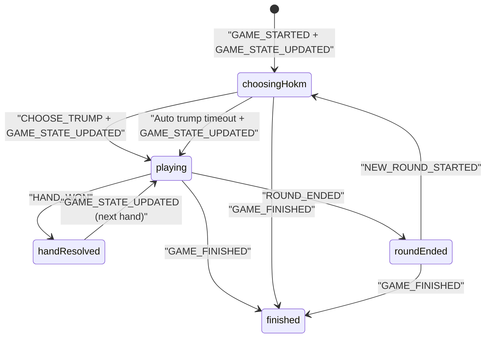

# مستند اجرایی بازی حکم برای فرانت وب (WS v3) - As-Is + Gap

- نسخه: `1.0`
- تاریخ: `2026-03-03`
- وضعیت: `Ready for Frontend Implementation`
- دامنه: `Hokm Gameplay + WS Core (ACK/ERROR/Resync/StateVersion)`

---

## 1) Contract Scope & Source of Truth

این سند با سیاست `As-Is + Gap` نوشته شده است:

- `As-Is`: رفتار runtime فعلی backend مرجع اصلی است.
- `Contract`: قرارداد WS v3 و کاتالوگ payloadها مرجع ثانویه است.
- `GAP`: هر اختلاف بین runtime و contract با شناسه `GAP-###` ثبت می‌شود.

### 1.1 مرجع‌های اصلی کد

1. Backend WS v3 Router:
- `gameBackend/src/main/java/com/gameapp/game/ImprovedWebSocketConfig.java`

2. Backend Hokm Runtime:
- `gameBackend/src/main/java/com/gameapp/game/services/HokmEngineService.java`

3. Backend Envelope/Error:
- `gameBackend/src/main/java/com/gameapp/game/services/WsEnvelopeService.java`
- `gameBackend/src/main/java/com/gameapp/game/services/WebSocketMessageHandler.java`
- `gameBackend/src/main/java/com/gameapp/game/constants/WsErrorCodes.java`

4. Frontend WS Runtime:
- `gameapp/lib/core/services/websocket_manager.dart`
- `gameapp/lib/core/websocket/ws_contract_catalog.dart`
- `gameapp/lib/core/websocket/ws_error_policy.dart`

5. Frontend Hokm UI Reference:
- `gameapp/lib/features/game/ui/game_ui/hokm_game_ui.dart`
- `gameapp/lib/features/game/data/models/hokm_game_state.dart`

6. Contract Docs:
- `docs/WS_V3_PAYLOAD_INVENTORY.md`
- `docs/OPUS_WS_V3_IMPLEMENTATION_GUIDE.md`
- `docs/opus_ws_v3_contract.json`

### 1.2 محدوده خارج از این سند

- قابلیت‌های social/friends/wallet/history
- بازی‌های غیر از Hokm
- مسیر legacy `/ws-v2` یا `WebSocketController` قدیمی

---

## 2) WS Endpoint, Envelope, Connection Rules

## 2.1 Endpoint

- `endpoint`: `/ws-v3`
- `protocolVersion`: `v3`

## 2.2 Envelope Contract

کلاینت باید همه پیام‌ها را به‌صورت envelope تفسیر کند. فیلدهای مهم:

- `type`
- `action` (برای `GAME_ACTION`)
- `roomId`
- `data`
- `eventId`
- `traceId`
- `serverTime`
- `protocolVersion`
- `stateVersion`
- `clientActionId` (برای همبستگی اکشن‌ها)

## 2.3 AUTH الزامات

درخواست `AUTH` باید شامل این فیلدها باشد:

- `token`
- `protocolVersion`
- `appVersion`
- `capabilities`
- `deviceId` (در حالت enforce)

### نمونه AUTH

```json
{
  "type": "AUTH",
  "token": "<jwt>",
  "protocolVersion": "v3",
  "appVersion": "3.0.0",
  "capabilities": [
    "CLIENT_ACTION_ID",
    "EVENT_DEDUP",
    "ACTION_ACK",
    "ACTION_REJECTED",
    "RESYNC_HANDLER",
    "STATE_VERSION",
    "MATCH_ID",
    "CLIENT_TELEMETRY"
  ],
  "deviceId": "web-device-001"
}
```

## 2.4 رفتار اجباری session/auth error

| `errorCode` | رفتار اجباری فرانت |
|---|---|
| `AUTH_EXPIRED` | پاک‌سازی auth، قطع WS، هدایت به login |
| `TOKEN_REVOKED` | پاک‌سازی auth، قطع WS، هدایت به login |
| `INVALID_TOKEN` | پاک‌سازی auth، قطع WS، هدایت به login |

---

## 3) Public Interfaces & Type Contracts (TypeScript)

این تایپ‌ها قرارداد مرجع فرانت وب هستند.

```ts
export type WsMessageType =
  | "AUTH"
  | "GAME_ACTION"
  | "GET_GAME_STATE_BY_ROOM"
  | "ACTION_ACK"
  | "STATE_SNAPSHOT"
  | "ERROR"
  | "GAME_STARTED";

export type HokmAction =
  | "CHOOSE_TRUMP"
  | "PLAY_CARD"
  | "TURN_TIMEOUT";

export type HokmSignalAction =
  | "GAME_STATE_UPDATED"
  | "HAND_WON"
  | "ROUND_ENDED"
  | "NEW_ROUND_STARTED"
  | "GAME_FINISHED";

export type CardSuit = "hearts" | "spades" | "diamonds" | "clubs";
export type CardRank = "2" | "3" | "4" | "5" | "6" | "7" | "8" | "9" | "10" | "J" | "Q" | "K" | "A";
export type CardWire = `${CardRank}${"h" | "s" | "d" | "c"}`;

export interface WsEnvelope<TData = unknown> {
  type: string;
  action?: string;
  roomId?: number;
  success?: boolean;
  data?: TData;
  errorCode?: string;
  error?: string;
  eventId?: string;
  traceId?: string;
  serverTime?: string;
  protocolVersion?: string;
  stateVersion?: number;
  clientActionId?: string;
}

export interface HokmCard {
  suit: CardSuit;
  rank: CardRank;
  isVisible?: boolean;
  seatNumber?: number;
  playerId?: number;
}

export interface HokmPlayerState {
  playerId: number;
  username: string;
  isHakem?: boolean;
  isCurrentTurn?: boolean;
  score?: number;
  seatNumber?: number;
  teamId?: 1 | 2;
  handCards?: HokmCard[];
}

export interface HokmUiState {
  gameStateId: number;
  roomId: number;
  gameId?: string;
  phase: "choosingHokm" | "playing" | "finished";
  currentRound: number;
  hakemPlayerId?: number;
  currentTurnPlayerId?: number;
  trumpSuit?: CardSuit;
  trumpMode?: string;
  leadSuit?: CardSuit;
  teamAScore: number;
  teamBScore: number;
  teamARoundWins: number;
  teamBRoundWins: number;
  players: HokmPlayerState[];
  playedCards: HokmCard[];
  playedCardsWithSeats: HokmCard[];
  stateVersion: number;
}

export interface HokmActionPayloadMap {
  CHOOSE_TRUMP: { gameStateId: number; trumpSuit: CardSuit; trumpMode?: "NORMAL" | string };
  PLAY_CARD: { gameStateId: number; card: CardWire };
  TURN_TIMEOUT: { gameStateId: number };
}

export interface HokmSignalPayloadMap {
  GAME_STATE_UPDATED: Partial<HokmUiState> & { gameId?: string };
  HAND_WON: {
    winnerId: number;
    winnerUsername?: string;
    teamId: 1 | 2;
    winningCard?: string;
    teamAScore?: number;
    teamBScore?: number;
    playedCards?: string[];
  };
  ROUND_ENDED: {
    roundNumber: number;
    teamAScore: number;
    teamBScore: number;
    totalTeamAWins: number;
    totalTeamBWins: number;
  };
  NEW_ROUND_STARTED: Partial<HokmUiState> & { currentRound: number };
  GAME_FINISHED: {
    players?: Array<{ username?: string; isWinner?: boolean; teamId?: number; coins?: number; xp?: number }>;
    coinRewards?: { totalPot?: number; platformFee?: number; winnerReward?: number; rewardPerWinner?: number };
    xpRewards?: { winner?: number; loser?: number };
    winnerId?: number;
  };
}

export interface PendingActionState {
  clientActionId: string;
  action: HokmAction;
  roomId: number;
  gameStateId: number;
  sentAtMs: number;
  retryCount: number;
  maxRetries: number;
  ackTimeoutMs: number;
}
```

---

## 4) Hokm Action Catalog (Client -> Server)

## 4.1 قواعد عمومی `GAME_ACTION`

- `type` باید `GAME_ACTION` باشد.
- `action` اجباری است.
- `roomId` اجباری است.
- `clientActionId` اجباری است.
- `data.stateVersion` اجباری است.
- `playerId` در payload اگر باشد با session user تطبیق داده می‌شود؛ مرجع نهایی بازیکن، session است.
- `ACTION_ACK` به معنی پذیرش در صف پردازش است، نه نتیجه نهایی state.

## 4.2 جدول اکشن‌ها

| اکشن | Envelope | ورودی اجباری | ورودی اختیاری | ولیدیشن فرانت قبل از ارسال | ACK مورد انتظار | سیگنال async مورد انتظار | خطاهای محتمل |
|---|---|---|---|---|---|---|---|
| `CHOOSE_TRUMP` | `type=GAME_ACTION`, `action=CHOOSE_TRUMP` | `gameStateId`, `trumpSuit` | `trumpMode` | فاز باید `choosingHokm` باشد، کاربر باید `hakem` باشد، `trumpSuit` یکی از 4 خال | `ACTION_ACK` | `GAME_STATE_UPDATED` با `phase=playing` و `trumpSuit` | `ACTION_REJECTED`, `STATE_RESYNC_REQUIRED` |
| `PLAY_CARD` | `type=GAME_ACTION`, `action=PLAY_CARD` | `gameStateId`, `card` | - | نوبت کاربر باشد، کارت در دست باشد، follow-suit رعایت شود | `ACTION_ACK` | `GAME_STATE_UPDATED`، در انتهای دست `HAND_WON` | `ACTION_REJECTED`, `STATE_RESYNC_REQUIRED` |
| `TURN_TIMEOUT` | `type=GAME_ACTION`, `action=TURN_TIMEOUT` | `gameStateId` | - | فقط وقتی تایمر نوبت کاربر صفر شد/timeout داخلی رخ داد ارسال شود | `ACTION_ACK` | As-Is: تضمین broadcast مستقیم ندارد (GAP-001) | `ACTION_REJECTED`, `STATE_RESYNC_REQUIRED` |
| `GET_GAME_STATE_BY_ROOM` | `type=GET_GAME_STATE_BY_ROOM` | `roomId` | - | در resync/timeout watchdog یا ورود دیرهنگام استفاده شود | Success envelope | `STATE_SNAPSHOT` | `ACTION_REJECTED` |

## 4.3 Card Wire Encoding

فرمت کارت ارسالی در `PLAY_CARD`:

- `rank + suitLetter`
- `suitLetter ∈ {h,s,d,c}`
- مثال‌ها: `10h`, `Qs`, `Ac`, `7d`

نکته: backend با `normalizeClientCard` این فرمت را به نماد داخلی (`♥♠♦♣`) تبدیل می‌کند.

---

## 5) Hokm Signal Catalog (Server -> Client)

## 5.1 سیگنال‌های هسته

| سیگنال | شکل envelope | فیلدهای مهم payload | معنای عملیاتی |
|---|---|---|---|
| `GAME_STARTED` | `type=GAME_STARTED` | `roomId`, `gameType` | شروع رسمی بازی در روم |
| `ACTION_ACK` | `type=ACTION_ACK` | `data.action`, `data.roomId`, `data.clientActionId`, `data.accepted`, `data.stateVersion?`, `data.duplicate?` | پذیرش اکشن در صف؛ نه نتیجه نهایی |
| `ERROR` | `type=ERROR` | `action`, `errorCode`, `error`, `roomId?`, `clientActionId?`, `stateVersion?` | خطای پروتکل/اکشن |
| `STATE_SNAPSHOT` | `type=STATE_SNAPSHOT` | `roomId`, `data` | snapshot authoritative برای resync |

## 5.2 سیگنال‌های gameplay حکم (`type=GAME_ACTION`)

| `action` | فیلدهای کلیدی data | اثر روی state |
|---|---|---|
| `GAME_STATE_UPDATED` | `gameId`, `phase`, `hakemPlayerId`, `currentTurnPlayerId`, `trumpSuit?`, `trumpMode?`, `teamAScore`, `teamBScore`, `teamARoundWins`, `teamBRoundWins`, `currentRound`, `leadSuit?`, `players[]`, `playedCards[]`, `playedCardsWithSeats[]`, `stateVersion?` | منبع اصلی و authoritative برای sync state حکم |
| `HAND_WON` | `winnerId`, `winnerUsername`, `winningCard`, `teamId`, `teamAScore`, `teamBScore`, `playedCards[]` | نتیجه دست فعلی؛ پس از آن باید منتظر state update بعدی بود |
| `ROUND_ENDED` | `roundNumber`, `teamAScore`, `teamBScore`, `totalTeamAWins`, `totalTeamBWins` | پایان راند فعلی |
| `NEW_ROUND_STARTED` | `currentRound`, `hakemPlayerId`, `currentTurnPlayerId`, `phase`, `teamARoundWins`, `teamBRoundWins`, `players[]`, `playedCards=[]`, `leadSuit=null` | شروع راند جدید و reset state راند |
| `GAME_FINISHED` | `players[]`, `coinRewards`, `xpRewards`, `winnerId?` | پایان بازی و نمایش نتیجه نهایی |

## 5.3 قاعده State Authority

1. `GAME_STATE_UPDATED` و `NEW_ROUND_STARTED` مرجع اصلی state هستند.
2. `HAND_WON` و `ROUND_ENDED` event-result هستند و به‌تنهایی نباید state کامل را overwrite کنند.
3. در `STATE_SNAPSHOT` باید replace کامل state انجام شود، نه merge جزئی.

---

## 6) Frontend Behavior Matrix (اکشن/سیگنال -> کار فرانت)

| Trigger | کار روی Store/State | کار UI/UX | Side Effects |
|---|---|---|---|
| ارسال `CHOOSE_TRUMP` | pendingAction اضافه شود | دکمه انتخاب حکم disable شود | شروع ACK انتظار |
| دریافت `ACTION_ACK` برای `CHOOSE_TRUMP` | pendingAction حذف شود | پیام موفقیت transient (اختیاری) | منتظر `GAME_STATE_UPDATED` بماند |
| دریافت `GAME_STATE_UPDATED` با `phase=playing` | `trumpSuit`, turn, players, cards آپدیت شود | دیالوگ انتخاب حکم بسته شود | تایمر turn ری‌استارت |
| ارسال `PLAY_CARD` | pendingAction اضافه شود | کارت انتخابی lock شود، submit disable | optimistic حذف کارت انجام نشود |
| دریافت `GAME_STATE_UPDATED` بعد `PLAY_CARD` | state کامل آپدیت شود | کارت از دست کاربر حذف شود، نوبت بعدی نمایش داده شود | تایمر بازتنظیم |
| دریافت `HAND_WON` | marker نتیجه دست ثبت شود | انیمیشن برنده دست نمایش داده شود | آماده reset برای دست بعد |
| دریافت `ROUND_ENDED` | scoreboard راند به‌روز شود | toast/banner پایان راند | منتظر `NEW_ROUND_STARTED` |
| دریافت `NEW_ROUND_STARTED` | reset راند: `playedCards=[]`, `leadSuit=null`, `currentRound++` | نمایش «راند جدید» | اگر hakem=me، prompt انتخاب حکم |
| دریافت `GAME_FINISHED` | state قفل نهایی شود | modal نتیجه + coin/xp | navigation به لابی/خانه |
| دریافت `ERROR/ACTION_REJECTED` | pendingAction مرتبط حذف شود | پیام خطا به کاربر | replay دستی اکشن (اختیاری) |
| دریافت `ERROR/STATE_RESYNC_REQUIRED` | state فعلی freeze موقت | loading کوتاه نمایش داده شود | فوری `GET_GAME_STATE_BY_ROOM` |
| دریافت `STATE_SNAPSHOT` | replace کامل state | خروج از loading | reset pending غیرمرتبط |

### 6.1 Rule: Non-Optimistic Gameplay

- `CHOOSE_TRUMP` و `PLAY_CARD` و `TURN_TIMEOUT` باید non-optimistic باشند.
- فقط بعد از سیگنال authoritative (`GAME_STATE_UPDATED` یا snapshot) state پایدار تغییر کند.

---

## 7) Hokm State Machine



## 7.1 قوانین نوبت و move validation

- فقط بازیکنی که `currentTurnPlayerId == myUserId` دارد می‌تواند `PLAY_CARD` بزند.
- اگر `leadSuit` وجود دارد و بازیکن از همان خال در دست دارد، باید همان خال را بازی کند.
- اگر `leadSuit` در دست بازیکن نیست، هر کارت مجاز است.

---

## 8) Error & Resync Policy

| `errorCode` | Trigger رایج | اقدام قطعی فرانت |
|---|---|---|
| `ACTION_REJECTED` | payload غلط، move غیرمجاز، state conflict | نمایش خطا، پاک کردن pending مرتبط، بدون تغییر state optimistic |
| `STATE_RESYNC_REQUIRED` | `stateVersion` قدیمی یا timeout/queue issue | فوری `GET_GAME_STATE_BY_ROOM` و replace کامل state |
| `RATE_LIMITED` | throttling سرور | backoff و retry بعدی |
| `AUTH_EXPIRED` | session/token منقضی | logout flow اجباری |
| `TOKEN_REVOKED` | revoke سمت سرور | logout flow اجباری |
| `INVALID_TOKEN` | JWT نامعتبر | logout flow اجباری |

## 8.1 Ordering & Dedup

- بر اساس `eventId`: پیام تکراری drop شود.
- بر اساس `stateVersion`: پیام out-of-order drop شود.
- streamهای ordered برای state: `GAME_ACTION`, `STATE_SNAPSHOT`, `GAME_STATE`.

---

## 9) GAP Register (As-Is vs Contract)

| GAP ID | عنوان | Severity | واقعیت As-Is | اثر روی UX | Workaround فرانت | Backend Fix پیشنهادی |
|---|---|---|---|---|---|---|
| `GAP-001` | نبود broadcast مستقیم بعد `TURN_TIMEOUT` در Hokm | High | `handleTurnTimeout` state را تغییر می‌دهد ولی broadcast صریح `GAME_STATE_UPDATED` ندارد | احتمال گیرکردن UI روی turn قبلی | watchdog بعد `TURN_TIMEOUT` (مثلا 2500ms)؛ اگر `GAME_STATE_UPDATED/HAND_WON/ROUND_ENDED/NEW_ROUND_STARTED` نرسید، `GET_GAME_STATE_BY_ROOM` بزن | در انتهای `handleTurnTimeout` همانند `playCard` یک `GAME_STATE_UPDATED` کامل emit شود |
| `GAP-002` | `TRUMP_SET` و `TURN_TIMER_STARTED` برای Hokm emit نمی‌شوند | Medium | این actionها در قرارداد/کاتالوگ هستند ولی در runtime حکم دیده نمی‌شوند | اگر فرانت برای حکم منتظر این eventها باشد، flow می‌شکند | برای Hokm فقط به `GAME_STATE_UPDATED` تکیه شود؛ `TRUMP_SET/TURN_TIMER_STARTED` را reserved در نظر بگیرید | یا برای Hokm emit واقعی اضافه شود یا در docs/contract به‌عنوان non-Hokm علامت بخورد |
| `GAP-003` | Shape ناهمگن `STATE_SNAPSHOT` نسبت به payload gameplay | Medium | snapshot از `GameState` entity برمی‌گردد، نه payload هم‌شکل `GAME_STATE_UPDATED` | parser پیچیده و خطاپذیر | یک adapter اختصاصی `snapshot -> HokmUiState` پیاده شود؛ failure-safe fallback داشته باشد | endpoint snapshot normalized مخصوص gameplay برگرداند |
| `GAP-004` | نبود enforce server-side روی نقش حاکم در `CHOOSE_TRUMP` | High | `chooseTrump` بررسی نمی‌کند caller حاکم هست یا نه | امکان انتخاب حکم توسط بازیکن غیرمجاز | gate سمت فرانت: فقط `isHakem && phase=choosingHokm` اجازه submit | در backend قبل از `chooseTrump` تطبیق user با `hakemPlayerId` اجباری شود |
| `GAP-005` | legacy event naming (`TRUMP_CHOSEN`, `CARD_PLAYED`) | Low | در مسیر legacy وجود دارد، در ws-v3 مرجع نیست | تیم وب ممکن است اشتباه listener بگذارد | در پیاده‌سازی وب فقط ws-v3 actions رسمی مصرف شوند | deprecate صریح مسیر legacy در docs |
| `GAP-006` | timeout نوبت حکم server-authoritative نیست | Medium | timeout نوبت به ارسال `TURN_TIMEOUT` از کلاینت وابسته است | تقلب/عدم‌همگامی تایمر بین کلاینت‌ها | تایمر محلی + watchdog snapshot | تایمر turn سمت سرور + emit `TURN_TIMER_STARTED` + auto timeout server-side |

---

## 10) Payload Examples (JSON)

## 10.1 `CHOOSE_TRUMP` request

```json
{
  "type": "GAME_ACTION",
  "action": "CHOOSE_TRUMP",
  "roomId": 1452,
  "clientActionId": "ca_1740981000000_1",
  "protocolVersion": "v3",
  "traceId": "web-abc-001",
  "data": {
    "gameStateId": 9088,
    "trumpSuit": "hearts",
    "trumpMode": "NORMAL",
    "stateVersion": 27
  }
}
```

## 10.2 `PLAY_CARD` request

```json
{
  "type": "GAME_ACTION",
  "action": "PLAY_CARD",
  "roomId": 1452,
  "clientActionId": "ca_1740981001200_2",
  "protocolVersion": "v3",
  "traceId": "web-abc-002",
  "data": {
    "gameStateId": 9088,
    "card": "Qs",
    "stateVersion": 28
  }
}
```

## 10.3 `TURN_TIMEOUT` request

```json
{
  "type": "GAME_ACTION",
  "action": "TURN_TIMEOUT",
  "roomId": 1452,
  "clientActionId": "ca_1740981030000_3",
  "protocolVersion": "v3",
  "traceId": "web-abc-003",
  "data": {
    "gameStateId": 9088,
    "stateVersion": 29
  }
}
```

## 10.4 `ACTION_ACK` response

```json
{
  "type": "ACTION_ACK",
  "success": true,
  "eventId": "7c8a9b30-9f6c-4e8c-9d4d-a3cc7f31f6cd",
  "traceId": "srv-9981",
  "serverTime": "2026-03-03T09:30:22.112Z",
  "protocolVersion": "v3",
  "stateVersion": 29,
  "data": {
    "action": "PLAY_CARD",
    "roomId": 1452,
    "clientActionId": "ca_1740981001200_2",
    "accepted": true,
    "stateVersion": 29
  }
}
```

## 10.5 `GAME_STATE_UPDATED` event

```json
{
  "type": "GAME_ACTION",
  "action": "GAME_STATE_UPDATED",
  "roomId": 1452,
  "eventId": "f6ef0a1b-3f22-4bc6-b7ef-7dbeab7e6d0a",
  "traceId": "srv-9982",
  "serverTime": "2026-03-03T09:30:22.445Z",
  "protocolVersion": "v3",
  "stateVersion": 30,
  "data": {
    "gameId": "9088",
    "phase": "playing",
    "hakemPlayerId": 21,
    "currentTurnPlayerId": 34,
    "trumpSuit": "hearts",
    "currentRound": 1,
    "teamAScore": 3,
    "teamBScore": 2,
    "teamARoundWins": 0,
    "teamBRoundWins": 0,
    "leadSuit": "spades",
    "players": [],
    "playedCards": [],
    "playedCardsWithSeats": [],
    "stateVersion": 30
  }
}
```

## 10.6 `ERROR/STATE_RESYNC_REQUIRED`

```json
{
  "type": "ERROR",
  "action": "GAME_ACTION",
  "roomId": 1452,
  "success": false,
  "errorCode": "STATE_RESYNC_REQUIRED",
  "error": "Client state is stale. Snapshot required.",
  "clientActionId": "ca_1740981001200_2",
  "stateVersion": 31,
  "eventId": "b20f52e2-cf7b-4f8b-aa0e-4aa5d15d3117",
  "traceId": "srv-9983",
  "serverTime": "2026-03-03T09:30:22.700Z",
  "protocolVersion": "v3"
}
```

## 10.7 Resync request + snapshot response

```json
{
  "type": "GET_GAME_STATE_BY_ROOM",
  "roomId": 1452
}
```

```json
{
  "type": "STATE_SNAPSHOT",
  "success": true,
  "roomId": 1452,
  "eventId": "5146a5b7-5090-4f41-9c0d-879fb2de01f2",
  "traceId": "srv-9984",
  "serverTime": "2026-03-03T09:30:22.910Z",
  "protocolVersion": "v3",
  "stateVersion": 31,
  "data": {
    "id": 9088,
    "currentRound": 1,
    "currentPlayerId": 34,
    "playedCards": [],
    "playedCardsWithSeats": [],
    "gameSpecificData": {
      "phase": "playing",
      "hakemPlayerId": 21,
      "trumpSuit": "hearts",
      "teamAScore": 3,
      "teamBScore": 2,
      "totalTeamAWins": 0,
      "totalTeamBWins": 0,
      "stateVersion": 31
    }
  }
}
```

---

## 11) QA Checklist & Acceptance Criteria

این چک‌لیست برای sign-off تیم فرانت/QA اجباری است:

- [ ] 1. Start flow: `GAME_STARTED` و سپس اولین `GAME_STATE_UPDATED` با `phase=choosingHokm`.
- [ ] 2. انتخاب حکم: `CHOOSE_TRUMP` -> `ACTION_ACK` -> `GAME_STATE_UPDATED` با `trumpSuit` و `phase=playing`.
- [ ] 3. Auto trump timeout: بدون انتخاب دستی حکم، state معتبر playing برسد.
- [ ] 4. بازی کارت معتبر: `PLAY_CARD` -> `ACTION_ACK` -> `GAME_STATE_UPDATED` با turn جدید.
- [ ] 5. بازی کارت نامعتبر: `ERROR/ACTION_REJECTED` و state محلی تغییر نکند.
- [ ] 6. پایان دست: `HAND_WON` و سپس reset دست بعدی با `GAME_STATE_UPDATED`.
- [ ] 7. پایان راند: `ROUND_ENDED` و سپس `NEW_ROUND_STARTED` با `hakem/currentRound` جدید.
- [ ] 8. پایان بازی: `GAME_FINISHED` و نمایش درست coin/xp و navigation.
- [ ] 9. stale state: `STATE_RESYNC_REQUIRED` -> `GET_GAME_STATE_BY_ROOM` -> `STATE_SNAPSHOT` -> replace کامل state.
- [ ] 10. pending-action timeout: نبود ACK تا deadline -> retry policy -> snapshot pull.
- [ ] 11. GAP timeout workaround: بعد از `TURN_TIMEOUT` در نبود event update تا بازه watchdog، snapshot pull انجام شود.

---

## 12) مفروضات و Defaultهای قفل‌شده

1. زبان: فارسی فنی + کلیدهای پروتکل به انگلیسی.
2. دامنه: فقط حکم + WS core موردنیاز gameplay.
3. فرمت تحویل: Markdown table-driven.
4. سیاست اختلاف: `Both` (workaround فرانت + backend fix).
5. endpoint/version: فقط `ws-v3`.
6. state authority: آخرین `stateVersion`؛ در snapshot همیشه replace کامل.

---

## 13) Implementation Notes for Web Team

- برای حکم listener اصلی شما باید `GAME_ACTION` باشد و dispatch داخلی بر اساس `action` انجام شود.
- `ACTION_ACK` را فقط برای lifecycle اکشن (pending, retry, correlation) مصرف کنید.
- هرجا ambiguity داشتید، `GAME_STATE_UPDATED` مرجع اول و `STATE_SNAPSHOT` مرجع قطعی recovery است.
- روی اکشن‌های حکم، optimistic state mutation انجام ندهید.

