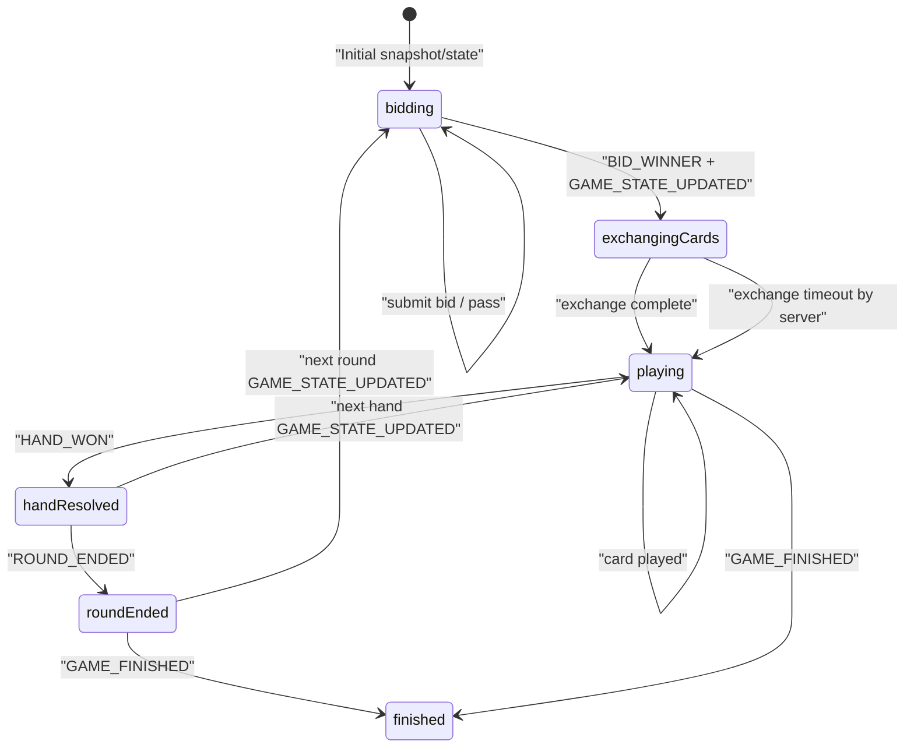

# مستند اجرایی شلم برای ایجنت فرانت وب

- نسخه: `1.0`
- تاریخ: `2026-03-11`
- وضعیت: `Frontend Agent Ready`
- دامنه: `Gameplay شلم روی وب + قرارداد WS لازم برای بازی`

---

## 1. هدف این سند

این سند باید برای ایجنت فرانت کافی باشد تا صفحه و منطق وب بازی شلم را پیاده‌سازی کند؛ شامل:

- تمام state های لازم برای UI
- تمام action های قابل ارسال به سرور
- تمام event های دریافتی از سرور
- همه ولیدیشن‌هایی که فرانت باید قبل از ارسال اکشن انجام دهد
- رفتار UI در هر فاز
- گپ‌های runtime فعلی که نباید از reference موبایل به‌صورت کورکورانه کپی شوند

این سند روی gameplay شلم تمرکز دارد. ساخت/ورود به روم، لیست روم‌ها، کیف پول، فرندها و سایر featureها خارج از این سند هستند.

---

## 2. Source Of Truth

مرجع قطعی این سند runtime فعلی backend است، نه UI موبایل.

### فایل‌های مرجع

- `gameBackend/src/main/java/com/gameapp/game/services/ShalemEngineService.java`
- `gameBackend/src/main/java/com/gameapp/game/ImprovedWebSocketConfig.java`
- `gameBackend/src/main/java/com/gameapp/game/core/common/CardUtils.java`
- `gameapp/lib/features/game/data/models/shelem_game_state.dart`
- `gameapp/lib/features/game/ui/game_ui/shelem_game_ui.dart`
- `docs/SHELEM_WEB_FRONTEND_SPEC.md`

### اصل مهم

- اگر بین Flutter فعلی و backend اختلاف بود، backend معتبر است.
- اگر بین contract عمومی WS و runtime شلم اختلاف بود، runtime شلم معتبر است.

---

## 3. خلاصه قوانین بازی که روی فرانت اثر دارند

- بازی ۴ نفره و تیمی است.
- صندلی‌ها به ترتیب `0,1,2,3` هستند.
- تیم‌ها:
  - تیم A: صندلی `0` و `2`
  - تیم B: صندلی `1` و `3`
- در شروع هر راند:
  - به هر بازیکن `12` کارت داده می‌شود.
  - `4` کارت وسط روی میز باقی می‌ماند.
- فازها:
  - `bidding`
  - `exchangingCards`
  - `playing`
  - `finished`
- در مزایده:
  - bid قابل ارسال از سمت کاربر فقط `105..160` با گام `5` یا `165` است.
  - `165` همان شلم است.
  - bid `100` هرگز از UI ارسال نمی‌شود؛ فقط وقتی همه پاس بدهند backend آخرین بازیکن فعال را با `100` برنده مزایده می‌کند.
- برنده مزایده `hakem` می‌شود.
- حاکم `4` کارت وسط را می‌گیرد و باید دقیقاً `4` کارت برگرداند.
- بعد از exchange:
  - بازی وارد فاز `playing` می‌شود.
  - حاکم اولین کارت را بازی می‌کند.
  - خال حکم به‌صورت خودکار از اولین کارت حاکم تعیین می‌شود.
- follow-suit اجباری است:
  - اگر بازیکن از `leadSuit` کارت داشته باشد، باید همان خال را بازی کند.
- امتیاز کارت‌ها:
  - `A = 10`
  - `10 = 10`
  - `5 = 5`
  - هر دست برنده شده `+5` بونوس دارد.
- `4` کارت برگشتی حاکم هم به‌عنوان یک دست مجازی حساب می‌شوند:
  - امتیاز کارت‌های دورریخته‌شده + `5`
  - یک trick هم برای تیم حاکم ثبت می‌شود.
- مجموع امتیاز هر راند `165` است.
- امتیاز هدف بازی بسته به `gameScore` روم:
  - `SHELEM_FIVE_HUNDRED -> 500`
  - `SHELEM_SEVEN_FIFTY -> 750`
  - `SHELEM_ELEVEN_SIXTY_FIVE -> 1165`

---

## 4. فرض‌های ورودی برای صفحه وب

صفحه gameplay شلم باید با این پیش‌نیازها mount شود:

- کاربر قبلاً authenticate شده است.
- WebSocket روی `/ws-v3` متصل و `AUTH` شده است.
- `roomId` را دارد.
- اطلاعات پایه روم را دارد:
  - `roomId`
  - `entryFee`
  - `gameScore`

### Boot Flow

در mount صفحه:

1. listenerهای WS ثبت شوند.
2. یک `GET_GAME_STATE_BY_ROOM` برای `roomId` ارسال شود.
3. با اولین `STATE_SNAPSHOT` یا اولین `GAME_STATE_UPDATED` store مقداردهی شود.
4. روی `GAME_STARTED` نباید تکیه شود؛ برای شلم deterministic نیست.

---

## 5. مدل داده‌ای پیشنهادی برای فرانت

```ts
export type ShelemPhase =
  | "bidding"
  | "exchangingCards"
  | "playing"
  | "finished";

export type CardSuit = "hearts" | "spades" | "diamonds" | "clubs";
export type CardRank = "2" | "3" | "4" | "5" | "6" | "7" | "8" | "9" | "10" | "J" | "Q" | "K" | "A";
export type CardWire = `${CardRank}${"h" | "s" | "d" | "c"}`;

export interface ShelemCard {
  suit: CardSuit;
  rank: CardRank;
  isVisible?: boolean;
  seatNumber?: number;
  playerId?: number;
}

export interface ShelemPlayer {
  playerId: number;
  username: string;
  seatNumber: number;
  teamId: 1 | 2;
  isCurrentTurn: boolean;
  isHakem: boolean;
  hasPassed: boolean;
  handCards: ShelemCard[];
}

export interface ShelemGameState {
  roomId: number; // from route/context
  gameStateId: number;
  phase: ShelemPhase;
  currentRound: number;
  currentTurnPlayerId?: number;
  currentBidderId?: number;
  hakemPlayerId?: number;
  bidWinnerId?: number;
  currentBid: number;
  winningBid?: number;
  leadSuit?: CardSuit;
  trumpSuit?: CardSuit;
  passedPlayerIds: number[];
  teamAScore: number;
  teamBScore: number;
  teamATrickScore: number;
  teamBTrickScore: number;
  teamATricks?: number; // local/derived if needed; backend currently does not emit in state payload
  teamBTricks?: number; // local/derived if needed; backend currently does not emit in state payload
  middleCards: ShelemCard[];
  playedCardsWithSeats: ShelemCard[];
  players: ShelemPlayer[];
  stateVersion: number; // from envelope top-level
}

export interface ShelemUiState {
  game: ShelemGameState | null;
  selectedPlayCard?: CardWire;
  selectedExchangeCards: CardWire[];
  pendingAction?: {
    clientActionId: string;
    action:
      | "SHELEM_SUBMIT_BID"
      | "SHELEM_PASS_BID"
      | "SHELEM_EXCHANGE_CARDS"
      | "SHELEM_PLAY_CARD"
      | "SHELEM_TURN_TIMEOUT";
  };
  turnTimerSeconds?: number;
  roundResultModal?: RoundEndedPayload;
  queuedGameFinished?: GameFinishedPayload;
}
```

### Adapter اجباری

در `GAME_STATE_UPDATED` و `STATE_SNAPSHOT` شناسه state با فیلد `gameId` به‌شکل string می‌آید.  
فرانت باید این adapter را اجباری اعمال کند:

```ts
gameStateId = Number(payload.gameId)
```

هر اکشن خروجی باید از `gameStateId` عددی استفاده کند، نه string خام.

---

## 6. چیدمان و رفتار بصری

### 6.1 Mapping صندلی‌ها روی UI

نمایش بازیکنان نسبت به بازیکن فعلی:

- پایین: `mySeat`
- بالا: `(mySeat + 2) % 4`
- چپ: `(mySeat + 3) % 4`
- راست: `(mySeat + 1) % 4`

### 6.2 مواردی که همیشه باید نمایش داده شوند

- scoreboard اصلی:
  - `teamAScore`
  - `teamBScore`
- scoreboard راند جاری:
  - `teamATrickScore`
  - `teamBTrickScore`
- شماره راند
- entry fee
- target score واقعی بر اساس `gameScore`
- نشان حاکم
- نشان پاس در فاز مزایده
- نشان خال حکم بعد از `TRUMP_SET`
- countdown سروری بر اساس `TURN_TIMER_STARTED`

### 6.3 نمایش کارت‌ها

- فقط کارت‌های دست خود بازیکن باید به‌صورت face-up نمایش داده شوند.
- کارت‌های حریفان باید همیشه hidden render شوند.
- حتی اگر backend فعلاً `handCards` بازیکنان دیگر را هم visible می‌فرستد، فرانت اجازه render آن‌ها را ندارد.

---

## 7. State Machine



### نکته مهم

برای شلم runtime فعلی معمولاً `NEW_ROUND_STARTED` قابل اتکا نیست.  
شروع راند بعد را با اولین `GAME_STATE_UPDATED` در فاز `bidding` تشخیص بدهید.

---

## 8. Action Catalog

تمام actionها با envelope زیر ارسال می‌شوند:

```json
{
  "type": "GAME_ACTION",
  "action": "SHELEM_PLAY_CARD",
  "roomId": 3107,
  "clientActionId": "ca_1761982004100_3",
  "data": {
    "gameStateId": 12011,
    "card": "Qs",
    "stateVersion": 22
  }
}
```

### قوانین عمومی همه actionها

- `type` باید `GAME_ACTION` باشد.
- `roomId` اجباری است.
- `clientActionId` اجباری است.
- `data.stateVersion` اجباری است.
- فرانت باید جدیدترین `stateVersion` را از آخرین snapshot/state نگه دارد.
- `playerId` برای شلم لازم نیست ارسال شود.
- اگر ارسال شد و با session کاربر یکی نباشد، سرور reject می‌کند.
- هیچ actionی optimistic روی state اصلی اعمال نشود.

### 8.1 `SHELEM_SUBMIT_BID`

#### ورودی

```ts
{
  gameStateId: number;
  bidAmount: 105 | 110 | 115 | 120 | 125 | 130 | 135 | 140 | 145 | 150 | 155 | 160 | 165;
  stateVersion: number;
}
```

#### ولیدیشن قبل از ارسال

- فاز باید `bidding` باشد.
- کاربر باید `currentBidderId` باشد.
- کاربر نباید قبلاً در `passedPlayerIds` باشد.
- `bidAmount` باید یکی از این‌ها باشد:
  - `105..160` با گام `5`
  - `165`
- `bidAmount` باید از `currentBid` بزرگ‌تر باشد.
- UI نباید `100` را به‌عنوان گزینه مزایده نمایش دهد.

#### خروجی مورد انتظار

- فوری:
  - `ACTION_ACK`
- async:
  - `BID_SUBMITTED`
  - سپس `GAME_STATE_UPDATED`
  - یا اگر مزایده تمام شود `BID_WINNER` و بعد `GAME_STATE_UPDATED`

#### رفتار UI

- پس از ارسال، input مزایده تا زمان دریافت event بعدی disable شود.
- تغییر state نهایی فقط از event سرور اعمال شود.

### 8.2 `SHELEM_PASS_BID`

#### ورودی

```ts
{
  gameStateId: number;
  stateVersion: number;
}
```

#### ولیدیشن قبل از ارسال

- فاز باید `bidding` باشد.
- کاربر باید `currentBidderId` باشد.
- کاربر نباید قبلاً پاس داده باشد.

#### خروجی مورد انتظار

- فوری:
  - `ACTION_ACK`
- async:
  - `BID_PASSED`
  - سپس `GAME_STATE_UPDATED`
  - یا اگر فقط یک بازیکن فعال بماند `BID_WINNER`

### 8.3 `SHELEM_EXCHANGE_CARDS`

#### ورودی

```ts
{
  gameStateId: number;
  cardsToReturn: [CardWire, CardWire, CardWire, CardWire];
  stateVersion: number;
}
```

#### ولیدیشن قبل از ارسال

- فاز باید `exchangingCards` باشد.
- کاربر باید `hakemPlayerId` باشد.
- دقیقاً `4` کارت باید انتخاب شده باشد.
- هر ۴ کارت باید distinct باشند.
- هر ۴ کارت باید داخل hand فعلی حاکم وجود داشته باشند.

#### خروجی مورد انتظار

- فوری:
  - `ACTION_ACK`
- async:
  - `GAME_STATE_UPDATED` با `phase=playing`
  - `teamXTrickScore` همان لحظه باید امتیاز دست مجازی کارت‌های برگشتی را نشان دهد.
  - اگر UI شمارنده trick دارد، افزایش trick اول را local derive کند؛ backend فعلاً آن را در state اصلی emit نمی‌کند.

#### رفتار UI

- تا قبل از انتخاب ۴ کارت، دکمه confirm غیرفعال باشد.
- با رسیدن به ۴ کارت، امکان submit فعال شود.
- پس از submit، selection پاک و UI قفل شود تا state جدید برسد.

### 8.4 `SHELEM_PLAY_CARD`

#### ورودی

```ts
{
  gameStateId: number;
  card: CardWire;
  stateVersion: number;
}
```

#### ولیدیشن قبل از ارسال

- فاز باید `playing` باشد.
- کاربر باید `currentTurnPlayerId` باشد.
- کارت باید در hand فعلی کاربر وجود داشته باشد.
- اگر `leadSuit` وجود دارد و کاربر از آن خال کارت دارد، فقط همان خال مجاز است.

#### خروجی مورد انتظار

- فوری:
  - `ACTION_ACK`
- async:
  - `GAME_STATE_UPDATED`
  - اگر اولین کارت حاکم باشد:
    - `TRUMP_SET`
  - اگر چهارمین کارت دست باشد:
    - `GAME_STATE_UPDATED` با ۴ کارت وسط میز
    - `HAND_WON`
    - بعد از delay کوتاه:
      - `GAME_STATE_UPDATED` دست بعدی یا
      - `ROUND_ENDED`

#### رفتار UI

- حذف optimistic کارت از دست بازیکن ممنوع است.
- کارت فقط بعد از `GAME_STATE_UPDATED` از hand حذف شود.
- بهتر است accidental misplay جلوگیری شود:
  - انتخاب + confirm
  - یا double-click
  - یا دکمه play

### 8.5 `SHELEM_TURN_TIMEOUT`

#### ورودی

```ts
{
  gameStateId: number;
  stateVersion: number;
}
```

#### استفاده

- fallback است، نه منبع اصلی timeout.
- منبع اصلی timeout خود سرور است.
- اگر timer UI صفر شد و هنوز event سروری نیامده بود، می‌توان این action را ارسال کرد.

#### اثر

- در `bidding`: پاس خودکار
- در `playing`: بازی‌کردن یک کارت معتبر به‌صورت خودکار
- در `exchangingCards`: این action استفاده نمی‌شود؛ timeout exchange را خود سرور handle می‌کند.

---

## 9. Event Catalog

### 9.1 `STATE_SNAPSHOT`

#### کاربرد

- bootstrap اولیه صفحه
- reconnect
- `STATE_RESYNC_REQUIRED`

#### رفتار فرانت

- `STATE_SNAPSHOT` برای شلم raw entity برمی‌گرداند و shape آن با `GAME_STATE_UPDATED` یکی نیست.
- فرانت باید ابتدا snapshot را normalize کند و بعد replace کامل state انجام دهد.
- merge جزئی ممنوع
- pending actionهای قدیمی و ناسازگار پاک شوند

#### shape تقریبی snapshot

```ts
{
  id: number;
  currentRound: number;
  currentPlayerId: number;
  playedCardsWithSeats?: Array<{
    card: string;
    seatNumber: number;
    playerId: number;
  }>;
  gameSpecificData: {
    phase?: "bidding" | "exchangingCards" | "playing" | "finished";
    currentBid?: number;
    currentBidderId?: number;
    hakemPlayerId?: number;
    bidWinnerId?: number;
    winningBid?: number;
    trumpSuit?: CardSuit;
    leadSuit?: CardSuit;
    passedPlayerIds?: number[];
    middleCards?: string[];
    teamAScore?: number;
    teamBScore?: number;
    teamATrickScore?: number;
    teamBTrickScore?: number;
    stateVersion?: number;
  };
  gameRoom?: {
    id: number;
    gameScore?: string;
    entryFee?: string;
    players?: Array<{
      user?: { id: number; username: string };
      seatNumber?: number;
      teamId?: 1 | 2;
      handCards?: string[];
    }>;
  };
}
```

#### normalizer پیشنهادی snapshot -> ShelemGameState

```ts
function normalizeShelemSnapshot(snapshot: any, roomId: number): ShelemGameState {
  const gs = snapshot?.gameSpecificData ?? {};
  const players = (snapshot?.gameRoom?.players ?? []).map((p: any) => ({
    playerId: Number(p?.user?.id ?? 0),
    username: String(p?.user?.username ?? ""),
    seatNumber: Number(p?.seatNumber ?? 0),
    teamId: Number(p?.teamId ?? 1) as 1 | 2,
    isCurrentTurn: Number(p?.user?.id) === Number(snapshot?.currentPlayerId),
    isHakem: Number(p?.user?.id) === Number(gs?.hakemPlayerId),
    hasPassed: (gs?.passedPlayerIds ?? []).map(Number).includes(Number(p?.user?.id)),
    handCards: (p?.handCards ?? []).map(parseCompactCard),
  }));

  return {
    roomId,
    gameStateId: Number(snapshot?.id ?? 0),
    phase: (gs?.phase ?? "bidding") as ShelemPhase,
    currentRound: Number(snapshot?.currentRound ?? 1),
    currentTurnPlayerId: Number(snapshot?.currentPlayerId ?? 0),
    currentBidderId: gs?.currentBidderId != null ? Number(gs.currentBidderId) : undefined,
    hakemPlayerId: gs?.hakemPlayerId != null ? Number(gs.hakemPlayerId) : undefined,
    bidWinnerId: gs?.bidWinnerId != null ? Number(gs.bidWinnerId) : undefined,
    currentBid: Number(gs?.currentBid ?? 100),
    winningBid: gs?.winningBid != null ? Number(gs.winningBid) : undefined,
    leadSuit: gs?.leadSuit,
    trumpSuit: gs?.trumpSuit,
    passedPlayerIds: (gs?.passedPlayerIds ?? []).map(Number),
    teamAScore: Number(gs?.teamAScore ?? 0),
    teamBScore: Number(gs?.teamBScore ?? 0),
    teamATrickScore: Number(gs?.teamATrickScore ?? 0),
    teamBTrickScore: Number(gs?.teamBTrickScore ?? 0),
    middleCards: (gs?.middleCards ?? []).map(parseCompactCard),
    playedCardsWithSeats: (snapshot?.playedCardsWithSeats ?? []).map((c: any) => ({
      ...parseCompactCard(c?.card),
      seatNumber: Number(c?.seatNumber ?? 0),
      playerId: Number(c?.playerId ?? 0),
    })),
    players,
    stateVersion: Number(gs?.stateVersion ?? 0),
  };
}
```

### 9.2 `GAME_STATE_UPDATED`

این event مرجع اصلی state است.

#### فیلدهای مهم

```ts
{
  gameId: string;
  phase: "bidding" | "exchangingCards" | "playing" | "finished";
  currentRound: number;
  currentTurnPlayerId: number;
  currentBidderId?: number;
  hakemPlayerId?: number;
  bidWinnerId?: number;
  currentBid: number;
  winningBid?: number;
  leadSuit?: CardSuit;
  trumpSuit?: CardSuit;
  passedPlayerIds: number[];
  teamAScore: number;
  teamBScore: number;
  teamATrickScore: number;
  teamBTrickScore: number;
  players: ShelemPlayer[];
  middleCards?: ShelemCard[];
  playedCardsWithSeats: ShelemCard[];
}
```

نکته:

- backend فعلی `teamATricks` و `teamBTricks` را داخل `GAME_STATE_UPDATED` ارسال نمی‌کند.
- اگر UI وب به شمارنده trick نیاز دارد، آن را از `HAND_WON` و exchange اولیه به‌صورت local derive کند.

#### رفتار فرانت

- همیشه روی state فعلی overwrite شود.
- `gameId` به `gameStateId` تبدیل شود.
- selectionهای local ناسازگار reset شوند:
  - `selectedPlayCard`
  - `selectedExchangeCards`
- اگر phase عوض شد UI متناظر باز/بسته شود.

### 9.3 `BID_SUBMITTED`

```ts
{
  playerId: number;
  bidAmount: number;
}
```

#### رفتار فرانت

- برای toast یا badge لحظه‌ای استفاده شود.
- state اصلی از `GAME_STATE_UPDATED` گرفته شود.

### 9.4 `BID_PASSED`

```ts
{
  playerId: number;
}
```

#### رفتار فرانت

- برای نشان PASS لحظه‌ای یا toast استفاده شود.
- state اصلی از `GAME_STATE_UPDATED` گرفته شود.

### 9.5 `BID_WINNER`

```ts
{
  hakemPlayerId: number;
  winningBid: number;
  middleCards: ShelemCard[];
}
```

#### رفتار فرانت

- دیالوگ مزایده بسته شود.
- نشان حاکم فعال شود.
- برای حاکم UI تبادل کارت باز شود.
- برای سایر بازیکنان حالت waiting نمایش داده شود.

### 9.6 `TRUMP_SET`

```ts
{
  trumpSuit: CardSuit;
}
```

#### رفتار فرانت

- badge یا آیکن حکم نمایش داده شود.
- بدون نیاز به state merge پیچیده؛ `GAME_STATE_UPDATED` مرجع نهایی است.

### 9.7 `TURN_TIMER_STARTED`

```ts
{
  gameStateId: number;
  timeoutSeconds: number;
}
```

#### رفتار فرانت

- تنها منبع معتبر countdown است.
- timer local را با همین مقدار set/restart کنید.
- مقادیر واقعی runtime فعلی:
  - `bidding = 15`
  - `playing = 20`
  - `exchangingCards = 60`

### 9.8 `HAND_WON`

```ts
{
  winnerId: number;
  winnerUsername: string;
  winningCard: string;
  teamId: 1 | 2;
  trickPoints: number;
  teamATrickScore: number;
  teamBTrickScore: number;
  playedCards: string[];
}
```

#### رفتار فرانت

- انیمیشن یا highlight برنده دست مجاز است.
- بلافاصله بعد از این event state کامل را overwrite نکنید.
- منتظر `GAME_STATE_UPDATED` بعدی بمانید.

### 9.9 `ROUND_ENDED`

```ts
export interface RoundEndedPayload {
  roundNumber: number;
  hakemTeamId: 1 | 2;
  hakemTeamScore: number;
  otherTeamScore: number;
  winningBid: number;
  hakemWon: boolean;
  isShelemBid: boolean;
  hakemPointsAdded: number;
  otherPointsAdded: number;
  teamAPointsAdded: number;
  teamBPointsAdded: number;
  teamAScore: number;
  teamBScore: number;
}
```

#### رفتار فرانت

- modal نتیجه راند باز شود.
- modal باید این‌ها را نشان دهد:
  - bid تعهد شده
  - امتیاز تیم حاکم در راند
  - امتیاز تیم مقابل در راند
  - موفق/ناموفق بودن تعهد
  - شلم بودن یا نبودن
  - تغییر امتیاز هر تیم
  - امتیاز کل دو تیم پس از راند
- بعد از بستن modal:
  - اگر `GAME_FINISHED` قبلاً رسیده بود، modal پایان بازی باز شود.
  - اگر نه، منتظر `GAME_STATE_UPDATED` راند بعد بماند.

### 9.10 `GAME_FINISHED`

```ts
export interface GameFinishedPayload {
  players: Array<{
    id: number;
    username: string;
    score?: number;
    coins?: number;
    xp?: number;
    isWinner: boolean;
    teamId: 1 | 2;
  }>;
  teamAScore: number;
  teamBScore: number;
  coinRewards?: {
    totalPot?: number;
    platformFee?: number;
    winnerReward?: number;
    rewardPerWinner?: number;
  };
  xpRewards?: {
    winner?: number;
    loser?: number;
  };
  gameRoom?: unknown;
  gameState?: unknown;
}
```

#### رفتار فرانت

- اگر modal نتیجه راند باز است، payload را queue کند.
- بعد از بسته شدن modal راند، modal پایان بازی باز شود.
- modal پایان بازی باید حداقل این‌ها را نشان دهد:
  - تیم برنده
  - امتیاز نهایی دو تیم
  - برندگان و بازندگان
  - coin reward
  - xp reward

---

## 10. Error Handling

### `ACTION_ACK`

- فقط یعنی action پذیرفته و وارد صف پردازش شده است.
- به معنی موفقیت نهایی gameplay نیست.
- pending action بعد از `ACTION_ACK` می‌تواند cleared شود، اما UI همچنان باید منتظر state/event نهایی بماند.

### `ERROR`

کدهای مهم:

- `ACTION_REJECTED`
- `STATE_RESYNC_REQUIRED`
- `RATE_LIMITED`
- `AUTH_EXPIRED`
- `TOKEN_REVOKED`
- `INVALID_TOKEN`

### رفتار لازم

- `ACTION_REJECTED`
  - pending action را پاک کن
  - پیام خطا نمایش بده
  - state local را optimistic اصلاح نکن

- `STATE_RESYNC_REQUIRED`
  - فوراً `GET_GAME_STATE_BY_ROOM` بزن
  - snapshot را replace کامل کن

- `RATE_LIMITED`
  - backoff کوتاه
  - دکمه مربوطه را موقتاً disable کن

- `AUTH_EXPIRED` / `TOKEN_REVOKED` / `INVALID_TOKEN`
  - logout flow اجباری
  - کاربر به login منتقل شود

---

## 11. ولیدیشن‌های UI به تفکیک فاز

### 11.1 فاز `bidding`

باید وجود داشته باشد:

- current bid
- current bidder
- PASS markerها
- bid modal یا panel
- countdown

اکشن‌های مجاز:

- `SHELEM_SUBMIT_BID`
- `SHELEM_PASS_BID`

ولیدیشن‌ها:

- فقط bidder فعلی interactive باشد.
- دکمه bidهای کمتر یا مساوی `currentBid` disabled باشند.
- اگر `currentBid === 165` شد فقط PASS باقی بماند.
- کاربری که پاس داده دیگر نباید bid بزند.

### 11.2 فاز `exchangingCards`

باید وجود داشته باشد:

- نمایش اینکه حاکم چه کسی است
- برای حاکم: UI انتخاب ۴ کارت
- برای دیگران: waiting state
- countdown

اکشن مجاز:

- `SHELEM_EXCHANGE_CARDS`

ولیدیشن‌ها:

- فقط حاکم interactive باشد.
- بیش از ۴ کارت قابل انتخاب نباشد.
- کمتر از ۴ کارت قابل submit نباشد.
- انتخاب تکراری مجاز نباشد.

### 11.3 فاز `playing`

باید وجود داشته باشد:

- میز بازی
- played cards با seat mapping
- hand خود بازیکن
- trump badge
- countdown

اکشن مجاز:

- `SHELEM_PLAY_CARD`

ولیدیشن‌ها:

- فقط بازیکن نوبت‌دار interactive باشد.
- فقط کارت‌های موجود در hand قابل انتخاب باشند.
- follow-suit enforce شود.
- اگر `leadSuit` وجود ندارد، هر کارتی مجاز است.

### 11.4 فاز `finished`

باید وجود داشته باشد:

- نتیجه نهایی
- coin/xp rewards
- مسیر خروج از بازی

اکشن gameplay جدید نباید ارسال شود.

---

## 12. محاسباتی که فرانت نباید خودش انجام دهد

فرانت نباید این‌ها را authoritative حساب کند:

- برنده مزایده
- حاکم
- خال حکم
- برنده دست
- امتیاز دست
- امتیاز راند
- امتیاز کل بازی
- timeout outcome

فرانت فقط می‌تواند برای UX preview یا disable/enable از derived state استفاده کند.

---

## 13. گپ‌ها و هشدارهای مهم برای پیاده‌سازی وب

### GAP-01: کارت‌های دست همه بازیکنان از backend visible می‌رسند

- این یک مشکل runtime است.
- فرانت وب باید فقط `handCards` بازیکن فعلی را render کند.
- برای سایر بازیکنان تعداد کارت را می‌توان نشان داد، اما نه خود کارت‌ها را.

### GAP-02: `gameId` به‌جای `gameStateId` در state

- adapter اجباری لازم است.

### GAP-03: timer موبایل reference معتبر نیست

- Flutter فعلی تایمرهای ثابت `20/10/15` را hardcode کرده است.
- برای وب فقط `TURN_TIMER_STARTED.timeoutSeconds` معتبر است.

### GAP-04: helper هدف امتیاز در Flutter اشتباه است

- Flutter فعلی مقادیر `1000` و `1500` دارد که با backend منطبق نیست.
- مقادیر درست:
  - `500`
  - `750`
  - `1165`

### GAP-05: شروع راند بعد با event مجزای ثابت تضمین نشده

- روی `NEW_ROUND_STARTED` تکیه نکنید.
- راند بعد را از `GAME_STATE_UPDATED` در `phase=bidding` تشخیص دهید.

---

## 14. ترتیب پیاده‌سازی پیشنهادی برای ایجنت فرانت

1. مدل state و adapter ورودی WS را بسازد.
2. bootstrap با `GET_GAME_STATE_BY_ROOM` را پیاده کند.
3. reducer اصلی `GAME_STATE_UPDATED` و `STATE_SNAPSHOT` را پیاده کند.
4. timer مبتنی بر `TURN_TIMER_STARTED` را پیاده کند.
5. bidding UI را با ولیدیشن کامل بسازد.
6. exchange UI را با انتخاب ۴ کارت و confirm بسازد.
7. playing UI را با follow-suit validation بسازد.
8. round result modal و game finished modal را اضافه کند.
9. خطاها و resync را نهایی کند.
10. masking دست حریف را enforce کند.

---

## 15. Definition Of Done

- کاربر با ورود به صفحه، state بازی را بدون reload کامل می‌بیند.
- bidding کامل با bid و pass کار می‌کند.
- exchange فقط برای حاکم و با دقیقاً ۴ کارت کار می‌کند.
- play card فقط برای نوبت فعلی و با follow-suit کار می‌کند.
- trump suit بعد از اولین کارت حاکم نمایش داده می‌شود.
- HAND_WON و ROUND_ENDED و GAME_FINISHED درست در UI منعکس می‌شوند.
- timer فقط از event سرور تغذیه می‌شود.
- `STATE_RESYNC_REQUIRED` بدون شکستن صفحه recover می‌شود.
- opponent handها هرگز روی وب لو نمی‌روند.
- target score درست `500/750/1165` نمایش داده می‌شود.

---

## 16. پیوست: نمونه payloadهای آماده

### Submit Bid

```json
{
  "type": "GAME_ACTION",
  "action": "SHELEM_SUBMIT_BID",
  "roomId": 3107,
  "clientActionId": "ca_1761982000000_1",
  "data": {
    "gameStateId": 12011,
    "bidAmount": 125,
    "stateVersion": 18
  }
}
```

### Pass Bid

```json
{
  "type": "GAME_ACTION",
  "action": "SHELEM_PASS_BID",
  "roomId": 3107,
  "clientActionId": "ca_1761982000100_2",
  "data": {
    "gameStateId": 12011,
    "stateVersion": 18
  }
}
```

### Exchange Cards

```json
{
  "type": "GAME_ACTION",
  "action": "SHELEM_EXCHANGE_CARDS",
  "roomId": 3107,
  "clientActionId": "ca_1761982002500_3",
  "data": {
    "gameStateId": 12011,
    "cardsToReturn": ["Ah", "10c", "5d", "2s"],
    "stateVersion": 21
  }
}
```

### Play Card

```json
{
  "type": "GAME_ACTION",
  "action": "SHELEM_PLAY_CARD",
  "roomId": 3107,
  "clientActionId": "ca_1761982004100_4",
  "data": {
    "gameStateId": 12011,
    "card": "Qs",
    "stateVersion": 22
  }
}
```

### Turn Timer Started

```json
{
  "type": "GAME_ACTION",
  "action": "TURN_TIMER_STARTED",
  "roomId": 3107,
  "data": {
    "gameStateId": 12011,
    "timeoutSeconds": 20
  }
}
```

### Round Ended

```json
{
  "type": "GAME_ACTION",
  "action": "ROUND_ENDED",
  "roomId": 3107,
  "data": {
    "roundNumber": 3,
    "hakemTeamId": 1,
    "hakemTeamScore": 120,
    "otherTeamScore": 45,
    "winningBid": 115,
    "hakemWon": true,
    "isShelemBid": false,
    "hakemPointsAdded": 120,
    "otherPointsAdded": 45,
    "teamAPointsAdded": 120,
    "teamBPointsAdded": 45,
    "teamAScore": 365,
    "teamBScore": 210
  }
}
```
