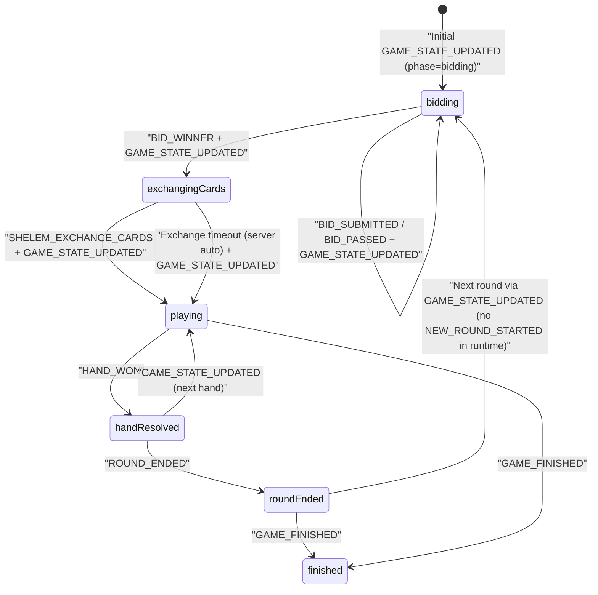

# مستند اجرایی بازی شلم برای فرانت وب (WS v3) - As-Is + Gap

- نسخه: `1.0`
- تاریخ: `2026-03-03`
- وضعیت: `Ready for Frontend Implementation`
- دامنه: `Shelem Gameplay + WS Core (ACK/ERROR/Resync/StateVersion)`

---

## 1) Contract Scope & Source of Truth

این سند با سیاست `As-Is + Gap` نوشته شده است:

- `As-Is`: رفتار runtime فعلی backend مرجع اصلی است.
- `Contract`: قرارداد WS v3 و کاتالوگ payloadها مرجع ثانویه است.
- `GAP`: هر اختلاف بین runtime و contract با شناسه `GAP-###` ثبت می‌شود.

### 1.1 مرجع‌های اصلی کد

1. Backend WS v3 Router:
- `gameBackend/src/main/java/com/gameapp/game/ImprovedWebSocketConfig.java`

2. Backend Shelem Runtime:
- `gameBackend/src/main/java/com/gameapp/game/services/ShalemEngineService.java`

3. Backend Broadcast/Envelope/Error:
- `gameBackend/src/main/java/com/gameapp/game/services/WebSocketRoomService.java`
- `gameBackend/src/main/java/com/gameapp/game/services/WsEnvelopeService.java`
- `gameBackend/src/main/java/com/gameapp/game/services/WebSocketMessageHandler.java`
- `gameBackend/src/main/java/com/gameapp/game/constants/WsErrorCodes.java`

4. Frontend WS Runtime:
- `gameapp/lib/core/services/websocket_manager.dart`
- `gameapp/lib/core/websocket/ws_contract_catalog.dart`
- `gameapp/lib/core/websocket/ws_error_policy.dart`

5. Frontend Shelem UI Reference:
- `gameapp/lib/features/game/ui/game_ui/shelem_game_ui.dart`
- `gameapp/lib/features/game/data/models/shelem_game_state.dart`
- `gameapp/lib/features/game/data/models/card.dart`

6. Contract Docs:
- `docs/WS_V3_PAYLOAD_INVENTORY.md`
- `docs/OPUS_WS_V3_IMPLEMENTATION_GUIDE.md`
- `docs/opus_ws_v3_contract.json`

### 1.2 محدوده خارج از این سند

- قابلیت‌های social/friends/wallet/history
- بازی‌های غیر از Shelem
- مسیر legacy `/ws-v2` و `WebSocketController` قدیمی

---

## 2) WS Endpoint, Envelope, Connection Rules

## 2.1 Endpoint

- `endpoint`: `/ws-v3`
- `protocolVersion`: `v3`

## 2.2 Envelope Contract

کلاینت باید همه پیام‌ها را به‌صورت envelope تفسیر کند. فیلدهای مهم:

- `type`
- `action` (برای `GAME_ACTION`)
- `roomId`
- `data`
- `eventId`
- `traceId`
- `serverTime`
- `protocolVersion`
- `stateVersion`
- `clientActionId` (برای همبستگی اکشن‌ها)

## 2.3 AUTH الزامات

درخواست `AUTH` باید شامل این فیلدها باشد:

- `token`
- `protocolVersion`
- `appVersion`
- `capabilities`
- `deviceId` (در حالت enforce)

### نمونه AUTH

```json
{
  "type": "AUTH",
  "token": "<jwt>",
  "protocolVersion": "v3",
  "appVersion": "3.0.0",
  "capabilities": [
    "CLIENT_ACTION_ID",
    "EVENT_DEDUP",
    "ACTION_ACK",
    "ACTION_REJECTED",
    "RESYNC_HANDLER",
    "STATE_VERSION",
    "MATCH_ID",
    "CLIENT_TELEMETRY"
  ],
  "deviceId": "web-device-001"
}
```

## 2.4 رفتار اجباری session/auth error

| `errorCode` | رفتار اجباری فرانت |
|---|---|
| `AUTH_EXPIRED` | پاک‌سازی auth، قطع WS، هدایت به login |
| `TOKEN_REVOKED` | پاک‌سازی auth، قطع WS، هدایت به login |
| `INVALID_TOKEN` | پاک‌سازی auth، قطع WS، هدایت به login |

---

## 3) Public Interfaces & Type Contracts (TypeScript)

این تایپ‌ها قرارداد مرجع فرانت وب هستند.

```ts
export type WsMessageType =
  | "AUTH"
  | "GAME_ACTION"
  | "GET_GAME_STATE_BY_ROOM"
  | "ACTION_ACK"
  | "STATE_SNAPSHOT"
  | "ERROR"
  | "GAME_STARTED";

export type CardSuit = "hearts" | "spades" | "diamonds" | "clubs";
export type CardRank = "2" | "3" | "4" | "5" | "6" | "7" | "8" | "9" | "10" | "J" | "Q" | "K" | "A";
export type CardWire = `${CardRank}${"h" | "s" | "d" | "c"}`;

export type ShelemAction =
  | "SHELEM_SUBMIT_BID"
  | "SHELEM_PASS_BID"
  | "SHELEM_EXCHANGE_CARDS"
  | "SHELEM_PLAY_CARD"
  | "SHELEM_TURN_TIMEOUT";

export type ShelemSignalAction =
  | "GAME_STATE_UPDATED"
  | "BID_SUBMITTED"
  | "BID_PASSED"
  | "BID_WINNER"
  | "TRUMP_SET"
  | "TURN_TIMER_STARTED"
  | "HAND_WON"
  | "ROUND_ENDED"
  | "GAME_FINISHED";

export interface WsEnvelope<TData = unknown> {
  type: string;
  action?: string;
  roomId?: number;
  success?: boolean;
  data?: TData;
  errorCode?: string;
  error?: string;
  eventId?: string;
  traceId?: string;
  serverTime?: string;
  protocolVersion?: string;
  stateVersion?: number;
  clientActionId?: string;
}

export interface ShelemCard {
  suit: CardSuit;
  rank: CardRank;
  isVisible?: boolean;
  seatNumber?: number;
  playerId?: number;
}

export interface ShelemPlayerState {
  playerId: number;
  username: string;
  teamId?: 1 | 2;
  seatNumber?: number;
  isHakem?: boolean;
  isCurrentTurn?: boolean;
  hasPassed?: boolean;
  handCards?: ShelemCard[];
}

export interface ShelemUiState {
  gameStateId: number; // from gameId string cast
  roomId: number;
  phase: "bidding" | "exchangingCards" | "playing" | "finished";
  currentRound: number;
  currentTurnPlayerId?: number;
  currentBidderId?: number;
  hakemPlayerId?: number;
  bidWinnerId?: number;
  currentBid: number;
  winningBid?: number;
  trumpSuit?: CardSuit;
  leadSuit?: CardSuit;
  teamAScore: number;
  teamBScore: number;
  teamATrickScore: number;
  teamBTrickScore: number;
  teamATricks: number;
  teamBTricks: number;
  passedPlayerIds: number[];
  players: ShelemPlayerState[];
  middleCards: ShelemCard[];
  playedCardsWithSeats: ShelemCard[];
  stateVersion: number;
}

export interface ShelemActionPayloadMap {
  SHELEM_SUBMIT_BID: { gameStateId: number; bidAmount: number };
  SHELEM_PASS_BID: { gameStateId: number };
  SHELEM_EXCHANGE_CARDS: { gameStateId: number; cardsToReturn: string[] | Array<{ suit: CardSuit; rank: string }> };
  SHELEM_PLAY_CARD: { gameStateId: number; card: string | { suit: CardSuit; rank: string } };
  SHELEM_TURN_TIMEOUT: { gameStateId: number };
}

export interface ShelemSignalPayloadMap {
  GAME_STATE_UPDATED: Partial<ShelemUiState> & { gameId?: string };
  BID_SUBMITTED: { playerId: number; bidAmount: number };
  BID_PASSED: { playerId: number };
  BID_WINNER: { hakemPlayerId: number; winningBid: number; middleCards?: ShelemCard[] };
  TRUMP_SET: { trumpSuit: CardSuit };
  TURN_TIMER_STARTED: { gameStateId: number; timeoutSeconds: number };
  HAND_WON: {
    winnerId: number;
    winnerUsername?: string;
    winningCard: string;
    teamId: 1 | 2;
    trickPoints: number;
    teamATrickScore: number;
    teamBTrickScore: number;
    playedCards: string[];
  };
  ROUND_ENDED: {
    roundNumber: number;
    hakemTeamId: 1 | 2;
    hakemTeamScore: number;
    otherTeamScore: number;
    winningBid: number;
    hakemWon: boolean;
    isShelemBid: boolean;
    hakemPointsAdded: number;
    otherPointsAdded: number;
    teamAPointsAdded: number;
    teamBPointsAdded: number;
    teamAScore: number;
    teamBScore: number;
  };
  GAME_FINISHED: {
    players?: Array<{ username?: string; isWinner?: boolean; teamId?: number; score?: number; coins?: number; xp?: number }>;
    teamAScore?: number;
    teamBScore?: number;
    coinRewards?: { totalPot?: number; platformFee?: number; winnerReward?: number; rewardPerWinner?: number };
    xpRewards?: { winner?: number; loser?: number };
  };
}

export interface PendingActionState {
  clientActionId: string;
  action: ShelemAction;
  roomId: number;
  gameStateId: number;
  sentAtMs: number;
  retryCount: number;
  maxRetries: number;
  ackTimeoutMs: number;
}
```

---

## 4) Shelem Action Catalog (Client -> Server)

## 4.1 قواعد عمومی `GAME_ACTION`

- `type` باید `GAME_ACTION` باشد.
- `action` اجباری است.
- `roomId` اجباری است.
- `clientActionId` اجباری است.
- `data.stateVersion` اجباری است.
- `playerId` اگر در payload باشد باید با session user یکسان باشد؛ مرجع نهایی session است.
- `ACTION_ACK` به معنی پذیرش در صف پردازش است، نه نتیجه نهایی state.

## 4.2 جدول اکشن‌ها

| اکشن | Envelope | ورودی اجباری | ورودی اختیاری | ولیدیشن فرانت قبل از ارسال | ACK مورد انتظار | سیگنال async مورد انتظار | خطاهای محتمل |
|---|---|---|---|---|---|---|---|
| `SHELEM_SUBMIT_BID` | `type=GAME_ACTION`, `action=SHELEM_SUBMIT_BID` | `gameStateId`, `bidAmount` | - | فاز `bidding` باشد، نوبت کاربر باشد، bid معتبر (105..160 step 5 یا 165 برای شلم) | `ACTION_ACK` | `BID_SUBMITTED` سپس `GAME_STATE_UPDATED` یا در پایان مزایده `BID_WINNER` | `ACTION_REJECTED`, `STATE_RESYNC_REQUIRED`, `RATE_LIMITED` |
| `SHELEM_PASS_BID` | `type=GAME_ACTION`, `action=SHELEM_PASS_BID` | `gameStateId` | - | فاز `bidding` باشد، نوبت کاربر باشد، قبلاً پاس نداده باشد | `ACTION_ACK` | `BID_PASSED` سپس `GAME_STATE_UPDATED` یا `BID_WINNER` | `ACTION_REJECTED`, `STATE_RESYNC_REQUIRED`, `RATE_LIMITED` |
| `SHELEM_EXCHANGE_CARDS` | `type=GAME_ACTION`, `action=SHELEM_EXCHANGE_CARDS` | `gameStateId`, `cardsToReturn` (4 کارت) | - | فاز `exchangingCards` باشد، کاربر `hakem` باشد، دقیقاً 4 کارت معتبر انتخاب شود | `ACTION_ACK` | `GAME_STATE_UPDATED` با `phase=playing` | `ACTION_REJECTED`, `STATE_RESYNC_REQUIRED` |
| `SHELEM_PLAY_CARD` | `type=GAME_ACTION`, `action=SHELEM_PLAY_CARD` | `gameStateId`, `card` | - | فاز `playing` باشد، نوبت کاربر باشد، کارت در دست باشد، follow-suit رعایت شود | `ACTION_ACK` | `GAME_STATE_UPDATED`؛ در انتهای دست `HAND_WON`؛ در اولین کارت حاکم `TRUMP_SET` | `ACTION_REJECTED`, `STATE_RESYNC_REQUIRED` |
| `SHELEM_TURN_TIMEOUT` | `type=GAME_ACTION`, `action=SHELEM_TURN_TIMEOUT` | `gameStateId` | - | فقط وقتی timeout واقعی UI اتفاق افتاد ارسال شود؛ prefer تکیه بر تایمر سرور | `ACTION_ACK` | نتیجه غیرمستقیم: auto-pass/auto-play و سیگنال‌های state/event مرتبط | `ACTION_REJECTED`, `STATE_RESYNC_REQUIRED` |
| `GET_GAME_STATE_BY_ROOM` | `type=GET_GAME_STATE_BY_ROOM` | `roomId` | - | در resync/timeout watchdog یا reconnect استفاده شود | Success envelope | `STATE_SNAPSHOT` | `ACTION_REJECTED` |

## 4.3 Card Encoding

برای `SHELEM_PLAY_CARD` و `SHELEM_EXCHANGE_CARDS` این شکل‌ها پذیرفته می‌شوند:

- string: `rank + suitLetter` مثل `10h`, `Qs`, `Ac`
- map: `{ suit, rank }`

runtime داخلی کارت را به compact symbol تبدیل می‌کند (مثل `Q♠`).

---

## 5) Shelem Signal Catalog (Server -> Client)

## 5.1 سیگنال‌های هسته

| سیگنال | شکل envelope | فیلدهای مهم payload | معنای عملیاتی |
|---|---|---|---|
| `GAME_STARTED` | `type=GAME_STARTED` | `roomId`, `gameType` | شروع رسمی بازی در روم (برای ws-v3 شلم اتکای قطعی ندارد؛ GAP-006) |
| `ACTION_ACK` | `type=ACTION_ACK` | `data.action`, `data.roomId`, `data.clientActionId`, `data.accepted`, `data.stateVersion?`, `data.duplicate?` | پذیرش اکشن در صف؛ نه نتیجه نهایی |
| `ERROR` | `type=ERROR` | `action`, `errorCode`, `error`, `roomId?`, `clientActionId?`, `stateVersion?` | خطای پروتکل/اکشن |
| `STATE_SNAPSHOT` | `type=STATE_SNAPSHOT` | `roomId`, `data` | snapshot authoritative برای resync |

## 5.2 سیگنال‌های gameplay شلم (`type=GAME_ACTION`)

| `action` | فیلدهای کلیدی data | اثر روی state |
|---|---|---|
| `GAME_STATE_UPDATED` | `gameId`, `phase`, `currentRound`, `currentTurnPlayerId`, `leadSuit`, `currentBid`, `currentBidderId`, `hakemPlayerId`, `bidWinnerId`, `winningBid`, `trumpSuit`, `passedPlayerIds`, `teamAScore`, `teamBScore`, `teamATrickScore`, `teamBTrickScore`, `players[]`, `middleCards?`, `playedCardsWithSeats[]` | سیگنال authoritative اصلی state |
| `BID_SUBMITTED` | `playerId`, `bidAmount` | نتیجه فوری ثبت bid |
| `BID_PASSED` | `playerId` | نتیجه فوری pass |
| `BID_WINNER` | `hakemPlayerId`, `winningBid`, `middleCards[]` | پایان مزایده و ورود به تبادل کارت |
| `TRUMP_SET` | `trumpSuit` | تعیین حکم بعد اولین کارت حاکم |
| `TURN_TIMER_STARTED` | `gameStateId`, `timeoutSeconds` | اعلان تایمر authoritative سرور |
| `HAND_WON` | `winnerId`, `winnerUsername`, `winningCard`, `teamId`, `trickPoints`, `teamATrickScore`, `teamBTrickScore`, `playedCards` | پایان دست جاری |
| `ROUND_ENDED` | `roundNumber`, `hakemTeamId`, `hakemTeamScore`, `otherTeamScore`, `winningBid`, `hakemWon`, `isShelemBid`, `hakemPointsAdded`, `otherPointsAdded`, `teamAPointsAdded`, `teamBPointsAdded`, `teamAScore`, `teamBScore` | پایان راند و نتیجه تعهد |
| `GAME_FINISHED` | `players[]`, `teamAScore`, `teamBScore`, `coinRewards`, `xpRewards` | پایان بازی و نتیجه نهایی |

## 5.3 قاعده State Authority

1. `GAME_STATE_UPDATED` مرجع اصلی state است.
2. `BID_*`, `TRUMP_SET`, `HAND_WON`, `ROUND_ENDED` event-result هستند و نباید به‌تنهایی state کامل را overwrite کنند.
3. در `STATE_SNAPSHOT` باید replace کامل state انجام شود، نه merge جزئی.

---

## 6) Frontend Behavior Matrix (اکشن/سیگنال -> کار فرانت)

| Trigger | کار روی Store/State | کار UI/UX | Side Effects |
|---|---|---|---|
| ارسال `SHELEM_SUBMIT_BID` | pendingAction اضافه شود | گزینه‌های مزایده disable | انتظار ACK |
| دریافت `BID_SUBMITTED` | bid marker بروزرسانی شود | badge روی بازیکن bid دهنده | منتظر state بعدی |
| ارسال `SHELEM_PASS_BID` | pendingAction اضافه شود | دکمه/اکشن pass lock | انتظار ACK |
| دریافت `BID_PASSED` | hasPassed بروزرسانی شود | نمایش PASS کنار بازیکن | منتظر state بعدی |
| دریافت `BID_WINNER` | hakem/winningBid/middleCards ست شود | بستن مزایده، بازکردن UI تبادل | شروع تایمر تبادل بر اساس `TURN_TIMER_STARTED` |
| ارسال `SHELEM_EXCHANGE_CARDS` | pendingAction اضافه شود | دکمه confirm تبادل disable | non-optimistic |
| دریافت `GAME_STATE_UPDATED` با `phase=playing` | state کامل آپدیت شود | بستن UI تبادل | شروع turn timer |
| دریافت `TRUMP_SET` | `trumpSuit` بروزرسانی شود | نمایش نشان حکم | - |
| ارسال `SHELEM_PLAY_CARD` | pendingAction اضافه شود | کارت انتخابی lock شود | optimistic حذف کارت انجام نشود |
| دریافت `GAME_STATE_UPDATED` بعد `SHELEM_PLAY_CARD` | hand/played cards/turn آپدیت شود | انیمیشن play card | reset timer |
| دریافت `HAND_WON` | نتیجه دست ثبت شود | انیمیشن winner دست | منتظر state بعدی یا پایان راند |
| دریافت `ROUND_ENDED` | scoreboard راند/کل بروزرسانی شود | دیالوگ نتیجه راند | انتظار `GAME_STATE_UPDATED` راند بعد |
| دریافت `TURN_TIMER_STARTED` | timer store `timeoutSeconds` set شود | نمایش countdown سرور | cancel timer محلی ناسازگار |
| دریافت `GAME_FINISHED` | state نهایی قفل شود | modal نتیجه + coin/xp | navigation به home/lobby |
| دریافت `ERROR/ACTION_REJECTED` | pendingAction مرتبط حذف شود | پیام خطا به کاربر | retry اختیاری |
| دریافت `ERROR/STATE_RESYNC_REQUIRED` | state freeze موقت | loading کوتاه | فوری `GET_GAME_STATE_BY_ROOM` |
| دریافت `STATE_SNAPSHOT` | replace کامل state | خروج از loading | reset pending غیرمرتبط |

### 6.1 Rule: Non-Optimistic Gameplay

- `SHELEM_EXCHANGE_CARDS` و `SHELEM_PLAY_CARD` باید non-optimistic باشند.
- مزایده (`SHELEM_SUBMIT_BID`/`SHELEM_PASS_BID`) هم state نهایی را فقط از event/server-state بگیرد.

### 6.2 Rule: Timer Authority

- منبع قطعی تایمر `TURN_TIMER_STARTED` است.
- تایمر محلی باید با timeout سرور sync شود؛ ارسال `SHELEM_TURN_TIMEOUT` فقط fallback است.

---

## 7) Shelem State Machine



## 7.1 قوانین نوبت و move validation

- در `bidding`: فقط `currentBidderId` حق `submit/pass` دارد.
- در `exchangingCards`: فقط `hakemPlayerId` حق تبادل دارد.
- در `playing`: فقط `currentTurnPlayerId` حق بازی کارت دارد.
- follow-suit اجباری است: اگر بازیکن خال `leadSuit` دارد باید همان خال را بازی کند.

---

## 8) Error & Resync Policy

| `errorCode` | Trigger رایج | اقدام قطعی فرانت |
|---|---|---|
| `ACTION_REJECTED` | payload غلط، move غیرمجاز، bid/card نامعتبر | نمایش خطا، پاک‌کردن pending مرتبط |
| `STATE_RESYNC_REQUIRED` | `stateVersion` قدیمی یا conflict | فوری `GET_GAME_STATE_BY_ROOM` و replace کامل state |
| `RATE_LIMITED` | throttling سرور | backoff و retry بعدی |
| `AUTH_EXPIRED` | session/token منقضی | logout flow اجباری |
| `TOKEN_REVOKED` | revoke سمت سرور | logout flow اجباری |
| `INVALID_TOKEN` | JWT نامعتبر | logout flow اجباری |

## 8.1 Ordering & Dedup

- بر اساس `eventId`: پیام تکراری drop شود.
- بر اساس `stateVersion`: پیام out-of-order drop شود.
- streamهای ordered برای state: `GAME_ACTION`, `STATE_SNAPSHOT`, `GAME_STATE`.

---

## 9) GAP Register (As-Is vs Contract)

| GAP ID | عنوان | Severity | واقعیت As-Is | اثر روی UX | Workaround فرانت | Backend Fix پیشنهادی |
|---|---|---|---|---|---|---|
| `GAP-001` | `NEW_ROUND_STARTED` در شلم emit نمی‌شود | Medium | runtime راند بعد را مستقیم با `GAME_STATE_UPDATED (phase=bidding)` شروع می‌کند | اگر listener فقط `NEW_ROUND_STARTED` را ببیند، راند بعدی شروع نمی‌شود | شروع راند را با `ROUND_ENDED` + اولین `GAME_STATE_UPDATED` تشخیص دهید | event `NEW_ROUND_STARTED` برای شلم هم emit شود یا contract علامت‌گذاری شود |
| `GAP-002` | field نامتجانس `gameId` به‌جای `gameStateId` در `GAME_STATE_UPDATED` | High | state payload کلید `gameId` (string) می‌دهد ولی actionها `gameStateId` می‌خواهند | احتمال ارسال اکشن با شناسه غلط | `gameStateId = Number(gameId)` adapter اجباری | payload state در شلم `gameStateId` استاندارد برگرداند |
| `GAP-003` | افشای دست همه بازیکنان در broadcast state | Critical | `broadcastGameState` برای همه بازیکنان `handCards` را با `isVisible=true` می‌فرستد | تقلب قطعی و شکست fairness بازی | در وب فقط دست خودی render شود و کارت حریف hidden بماند | backend payload per-user mask کند و کارت حریف را مخفی ارسال کند |
| `GAP-004` | تایمر UI با `TURN_TIMER_STARTED` sync نیست | High | runtime تایمر 15/20/60 می‌فرستد ولی UI فعلی تایمر ثابت 20 ثانیه دارد و event را مصرف نمی‌کند | timeout ناهماهنگ، UX ناپایدار | تایمر را فقط با `TURN_TIMER_STARTED.timeoutSeconds` راه‌اندازی کنید | enforce یک منبع تایمر واحد و حذف تایمر محلی ناسازگار |
| `GAP-005` | `FIRST_BIDDER_TIMEOUT_SECONDS=20` عملاً استفاده نشده | Low | متد `startTurnTimerForFirstBidder` وجود دارد ولی جریان اصلی از `startTurnTimer(..., bidding=true)` با 15 ثانیه استفاده می‌کند | ناسازگاری با انتظار محصول/مستند | فرانت روی timeout واقعی event تکیه کند نه فرض ثابت | یا متد first-bidder واقعاً در start flow فراخوانی شود یا constant/متد حذف شود |
| `GAP-006` | `GAME_STARTED` اتکای قطعی در ws-v3 شلم ندارد | Medium | مسیر start شلم عمدتاً با state/game-action جلو می‌رود و GAME_STARTED ممکن است deterministic نباشد | initialization فرانت ممکن است دیر شروع شود | start gameplay را با اولین `GAME_STATE_UPDATED` انجام دهید | در شروع engine برای ws-v3، `GAME_STARTED` استاندارد و قطعی emit شود |
| `GAP-007` | status میانی `roundEnded` به‌صورت state-phase emit نمی‌شود | Medium | فقط `ROUND_ENDED` event داریم و بعد از delay راند بعدی می‌آید | اگر UI فقط state-driven باشد، gap زمانی مبهم دارد | یک sub-state محلی `roundResult` با timeout/loader نگه دارید | phase موقت `roundEnded` در `GAME_STATE_UPDATED` یا event transition مشخص‌تر شود |

---

## 10) Payload Examples (JSON)

## 10.1 `SHELEM_SUBMIT_BID` request

```json
{
  "type": "GAME_ACTION",
  "action": "SHELEM_SUBMIT_BID",
  "roomId": 3107,
  "clientActionId": "ca_1761982000000_1",
  "protocolVersion": "v3",
  "traceId": "web-shelem-001",
  "data": {
    "gameStateId": 12011,
    "bidAmount": 125,
    "stateVersion": 18
  }
}
```

## 10.2 `SHELEM_EXCHANGE_CARDS` request

```json
{
  "type": "GAME_ACTION",
  "action": "SHELEM_EXCHANGE_CARDS",
  "roomId": 3107,
  "clientActionId": "ca_1761982002500_2",
  "protocolVersion": "v3",
  "traceId": "web-shelem-002",
  "data": {
    "gameStateId": 12011,
    "cardsToReturn": ["Ah", "10c", "5d", "2s"],
    "stateVersion": 21
  }
}
```

## 10.3 `SHELEM_PLAY_CARD` request

```json
{
  "type": "GAME_ACTION",
  "action": "SHELEM_PLAY_CARD",
  "roomId": 3107,
  "clientActionId": "ca_1761982004100_3",
  "protocolVersion": "v3",
  "traceId": "web-shelem-003",
  "data": {
    "gameStateId": 12011,
    "card": "Qs",
    "stateVersion": 22
  }
}
```

## 10.4 `ACTION_ACK` response

```json
{
  "type": "ACTION_ACK",
  "success": true,
  "eventId": "1ea8a9b5-2f4e-4a20-9c91-0959471d4d3b",
  "traceId": "srv-shelem-301",
  "serverTime": "2026-03-03T11:30:11.102Z",
  "protocolVersion": "v3",
  "stateVersion": 22,
  "data": {
    "action": "SHELEM_PLAY_CARD",
    "roomId": 3107,
    "clientActionId": "ca_1761982004100_3",
    "accepted": true,
    "stateVersion": 22
  }
}
```

## 10.5 `GAME_STATE_UPDATED` event (bidding)

```json
{
  "type": "GAME_ACTION",
  "action": "GAME_STATE_UPDATED",
  "roomId": 3107,
  "eventId": "cae1fd67-3c12-4500-aa9c-fbfa36b4edc6",
  "traceId": "srv-shelem-302",
  "serverTime": "2026-03-03T11:30:11.440Z",
  "protocolVersion": "v3",
  "stateVersion": 19,
  "data": {
    "gameId": "12011",
    "phase": "bidding",
    "currentRound": 1,
    "currentTurnPlayerId": 34,
    "currentBid": 125,
    "currentBidderId": 34,
    "passedPlayerIds": [21],
    "teamAScore": 0,
    "teamBScore": 0,
    "teamATrickScore": 0,
    "teamBTrickScore": 0,
    "players": [],
    "playedCards": [],
    "playedCardsWithSeats": [],
    "stateVersion": 19
  }
}
```

## 10.6 `BID_WINNER` + `TRUMP_SET` + `TURN_TIMER_STARTED`

```json
{
  "type": "GAME_ACTION",
  "action": "BID_WINNER",
  "roomId": 3107,
  "eventId": "88706629-c4c7-4da7-b75b-68b349db589f",
  "traceId": "srv-shelem-303",
  "serverTime": "2026-03-03T11:30:28.112Z",
  "protocolVersion": "v3",
  "stateVersion": 21,
  "data": {
    "hakemPlayerId": 34,
    "winningBid": 140,
    "middleCards": [],
    "stateVersion": 21
  }
}
```

```json
{
  "type": "GAME_ACTION",
  "action": "TRUMP_SET",
  "roomId": 3107,
  "eventId": "27f76db7-c8e0-4695-a83e-12f0513916a3",
  "traceId": "srv-shelem-304",
  "serverTime": "2026-03-03T11:31:17.665Z",
  "protocolVersion": "v3",
  "stateVersion": 24,
  "data": {
    "trumpSuit": "spades",
    "stateVersion": 24
  }
}
```

```json
{
  "type": "GAME_ACTION",
  "action": "TURN_TIMER_STARTED",
  "roomId": 3107,
  "eventId": "113fc04d-3510-4df7-9b5f-df58f93e3de5",
  "traceId": "srv-shelem-305",
  "serverTime": "2026-03-03T11:31:17.880Z",
  "protocolVersion": "v3",
  "stateVersion": 24,
  "data": {
    "gameStateId": 12011,
    "timeoutSeconds": 20,
    "stateVersion": 24
  }
}
```

## 10.7 `HAND_WON` and `ROUND_ENDED`

```json
{
  "type": "GAME_ACTION",
  "action": "HAND_WON",
  "roomId": 3107,
  "eventId": "1eca2191-9fe4-4f87-9a2a-e949e95a9f3c",
  "traceId": "srv-shelem-306",
  "serverTime": "2026-03-03T11:33:01.030Z",
  "protocolVersion": "v3",
  "stateVersion": 35,
  "data": {
    "winnerId": 55,
    "winnerUsername": "player55",
    "winningCard": "A♠",
    "teamId": 1,
    "trickPoints": 25,
    "teamATrickScore": 115,
    "teamBTrickScore": 45,
    "playedCards": ["A♠", "10♠", "5♥", "2♣"],
    "stateVersion": 35
  }
}
```

```json
{
  "type": "GAME_ACTION",
  "action": "ROUND_ENDED",
  "roomId": 3107,
  "eventId": "f8f48311-baf7-41cb-902d-8b08eae384be",
  "traceId": "srv-shelem-307",
  "serverTime": "2026-03-03T11:34:45.210Z",
  "protocolVersion": "v3",
  "stateVersion": 47,
  "data": {
    "roundNumber": 3,
    "hakemTeamId": 2,
    "hakemTeamScore": 130,
    "otherTeamScore": 35,
    "winningBid": 140,
    "hakemWon": false,
    "isShelemBid": false,
    "hakemPointsAdded": -140,
    "otherPointsAdded": 35,
    "teamAPointsAdded": 35,
    "teamBPointsAdded": -140,
    "teamAScore": 280,
    "teamBScore": 195,
    "stateVersion": 47
  }
}
```

## 10.8 `GAME_FINISHED` event

```json
{
  "type": "GAME_ACTION",
  "action": "GAME_FINISHED",
  "roomId": 3107,
  "eventId": "72b641ba-345f-49fd-9310-7f045e1acfb5",
  "traceId": "srv-shelem-308",
  "serverTime": "2026-03-03T11:40:40.004Z",
  "protocolVersion": "v3",
  "stateVersion": 63,
  "data": {
    "teamAScore": 510,
    "teamBScore": 305,
    "players": [],
    "coinRewards": {
      "totalPot": 200,
      "platformFee": 20,
      "winnerReward": 180,
      "rewardPerWinner": 90
    },
    "xpRewards": {
      "winner": 50,
      "loser": 10
    },
    "stateVersion": 63
  }
}
```

## 10.9 `ERROR/STATE_RESYNC_REQUIRED` + snapshot

```json
{
  "type": "ERROR",
  "action": "GAME_ACTION",
  "roomId": 3107,
  "success": false,
  "errorCode": "STATE_RESYNC_REQUIRED",
  "error": "Client state is stale. Snapshot required.",
  "clientActionId": "ca_1761982004100_3",
  "stateVersion": 48,
  "eventId": "5bf85c86-785f-4b17-a1ee-28bd9c1fa633",
  "traceId": "srv-shelem-309",
  "serverTime": "2026-03-03T11:34:45.500Z",
  "protocolVersion": "v3"
}
```

```json
{
  "type": "GET_GAME_STATE_BY_ROOM",
  "roomId": 3107
}
```

```json
{
  "type": "STATE_SNAPSHOT",
  "success": true,
  "roomId": 3107,
  "eventId": "53ea999e-0f5c-4d40-be3d-40767dfe7e1a",
  "traceId": "srv-shelem-310",
  "serverTime": "2026-03-03T11:34:45.650Z",
  "protocolVersion": "v3",
  "stateVersion": 48,
  "data": {
    "id": 12011,
    "currentRound": 4,
    "currentPlayerId": 21,
    "playedCards": [],
    "playedCardsWithSeats": [],
    "leadSuit": null,
    "gameSpecificData": {
      "phase": "bidding",
      "currentBid": 100,
      "currentBidderId": 21,
      "teamAScore": 280,
      "teamBScore": 195,
      "stateVersion": 48
    }
  }
}
```

---

## 11) QA Checklist & Acceptance Criteria

این چک‌لیست برای sign-off تیم فرانت/QA اجباری است:

- [ ] 1. Start flow: اولین `GAME_STATE_UPDATED` با `phase=bidding` دریافت شود.
- [ ] 2. مزایده معتبر: `SHELEM_SUBMIT_BID` -> `ACTION_ACK` -> `BID_SUBMITTED` و نوبت بعدی در `GAME_STATE_UPDATED`.
- [ ] 3. پاس مزایده: `SHELEM_PASS_BID` -> `ACTION_ACK` -> `BID_PASSED`.
- [ ] 4. پایان مزایده: دریافت `BID_WINNER` + `GAME_STATE_UPDATED` با `phase=exchangingCards`.
- [ ] 5. تبادل کارت: `SHELEM_EXCHANGE_CARDS` -> `ACTION_ACK` -> `GAME_STATE_UPDATED` با `phase=playing`.
- [ ] 6. تعیین حکم: اولین کارت حاکم -> دریافت `TRUMP_SET`.
- [ ] 7. بازی کارت معتبر: `SHELEM_PLAY_CARD` -> `ACTION_ACK` -> `GAME_STATE_UPDATED` (و در کارت چهارم `HAND_WON`).
- [ ] 8. بازی کارت نامعتبر: `ERROR/ACTION_REJECTED` و state محلی تغییر نکند.
- [ ] 9. پایان دست: `HAND_WON` و سپس state دست بعدی (`playedCardsWithSeats` پاک‌شده) برسد.
- [ ] 10. پایان راند: `ROUND_ENDED` و بعد از delay راند بعدی با `GAME_STATE_UPDATED (phase=bidding)`.
- [ ] 11. پایان بازی: `GAME_FINISHED` و نمایش صحیح team score + coin/xp + navigation.
- [ ] 12. stale state: `STATE_RESYNC_REQUIRED` -> `GET_GAME_STATE_BY_ROOM` -> `STATE_SNAPSHOT` -> replace کامل state.
- [ ] 13. timer sync: UI countdown دقیقاً از `TURN_TIMER_STARTED.timeoutSeconds` تبعیت کند.
- [ ] 14. security masking: در UI وب فقط hand خودی visible باشد (حتی اگر payload شامل hand دیگران باشد).

---

## 12) مفروضات و Defaultهای قفل‌شده

1. زبان: فارسی فنی + کلیدهای پروتکل به انگلیسی.
2. دامنه: فقط شلم + WS core موردنیاز gameplay.
3. فرمت تحویل: Markdown table-driven.
4. سیاست اختلاف: `Both` (workaround فرانت + backend fix).
5. endpoint/version: فقط `ws-v3`.
6. state authority: آخرین `stateVersion`؛ در snapshot همیشه replace کامل.

---

## 13) Implementation Notes for Web Team

- listener اصلی gameplay باید `type=GAME_ACTION` باشد و dispatch بر اساس `action`.
- `ACTION_ACK` فقط برای lifecycle اکشن مصرف شود؛ نه برای نتیجه بازی.
- adapter صریح `gameId -> gameStateId:number` داشته باشید.
- تایمر را از `TURN_TIMER_STARTED` بخوانید و تایمر hardcoded را حذف کنید.
- برای fairness، حتی در صورت payload ناامن، کارت‌های `players != me` را در UI مخفی رندر کنید.
